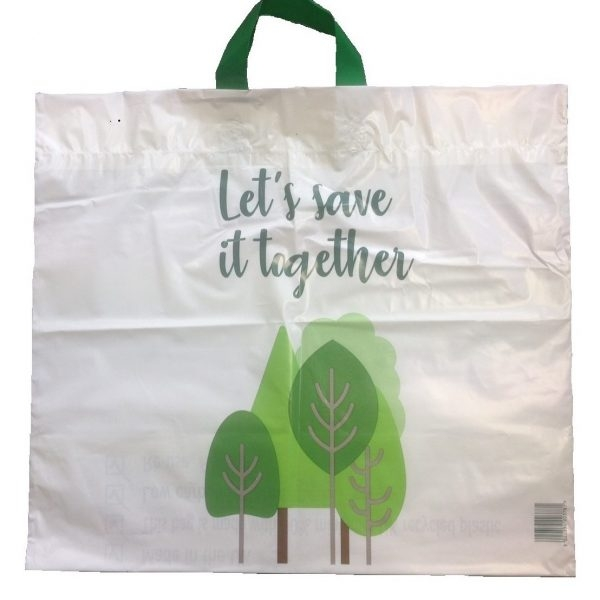

# 규제의 역설
###### 최성락 지음

## 1장 의도와 결과의 불일치

### 숲을 되살린 옐로스톤 늑대의 패러독스

- 1914년, 미국 의회는 목축 농가의 이익을 보호한다는 명목으로 사냥꾼들이 늑대를 마음껏 사냥하도록 허용하였다.
  - 늑대가 사라지자 농민들은 안심하고 가축을 잘 기를 수 있었지만, 시간이 지나면서 사슴이 너무 많아졌다. 사슴들은 농가나 목축지까지 내려와 곡식이나 가축에게 줄 목초를 뜯어먹기 시작했다.
  - 더 심각한 것은 전체 동물 개체수가 감소하고, 식물들도 규모가 작아진 것이다.
- 즉, 옐로스톤의 생태계가 악화되었다.
  - 정부는 옐로스톤의 생태계를 원래대로 돌려놓기 위해서 많은 노력을 했지만, 아무 소용이 없었다.
- 그런데, 1995년 13마리의 늑대를 옐로스톤 국립공원에 풀어놓자 약 10여년만에 생태계는 다시 원래대로 돌아갔다.
  - 결국 옐로스톤의 생태계를 파괴한 것은 늑대로부터 사슴을 보호하려던 1914년의 조치였다.

### 교통사고를 증가시키는 교통 표지판

- 런던 켄싱턴 자치정부는 관광 활성화를 위해 켄싱턴 거리에 있는 교통표지판과 교통안전 시설물을의 95%를 철거해버렸다.
  - 중앙정부와 런던시는 켄싱턴의 조치가 시민 안전을 위협할 것이라고 비판했다.
- 그런데, 표지판들을 없애고 나서 교통사고가 절반 이하로 줄어들었다.
  - 즉, 교통 표지판들은 실제로는 교통사고를 줄이지 못하고 있었던 것이다.
- 교통 표지판과 시설물이 없어지면서 사람들은 도로를 마구 건너기 시작했고, 운전자들은 사람들이 아무때나 아무데서나 길을 건넌다는 것을 알기 때문에 속도를 줄이고 주의를 집중하면서 운전했다.
  - 자동차와 사람들이 서로 섞인 거리가 되면서 이전보다 무질서해 보이긴 했지만, 사고 자체는 줄어들었다.
  
### 더 큰 산불의 위험을 키운 산불 예방 정책

- 1970년대 이전 미국의 산불정책은 초기진화를 목표로 했다. 산불이 발생하면 24시간 이내에 불을 끄는 것이다.
  - 산불 탐지 및 진화를 위한 헬리콥터를 충분히 갖추는 등 신속하게 출동하여 산불을 끌 수 있는 체계를 갖추었다.
- 그런데, 산불 관리가 철지히 되었던 지역에서 초기 진화에 실패를 하면 오히려 이전보다 훨씬 더 큰 산불이 발생했다.
  - 예전 같으면 산 3,4개를 태우다가 꺼질 것이 몇 십개가 넘는 산을 태우는 큰 산불로 이어졌다.
- 산불의 초기진화에 성공하면 숲 바닥에는 더 오래 건조된 나뭇잎과 나뭇가지들이 점점 더 두껍게 쌓인다. 그런 상황에서 발생한 산불이 겉잡을 수 없이 커지는 것이었다.
  - 산불 초기진화를 하지 않을 때는 몇 년에 한 번씩 3,4개의 산을 태우는 산불이 발생했는데, 산불관리를 엄격히 하면서 산불의 발생빈도는 10년에 한 번 정도로 줄었지만 그 산불은 몇 십개의 산을 태웠다.
  - 결과적으로 초기진화를 한 이후로 산불 피해가 더 커졌다.
- 그래서 미국은 1970년대 들어 초기진화 산불 정책을 포기하고, 'Let it burn' 정책으로 변경하였다.
  - 작은 산불을 놔두는 것이 장기적으로 또 총체적으로 볼 때 피해를 최소화할 수 있는 방법이라는 것을 자연으로부터 배웠기 때문이다.

### 비닐 쓰레기를 늘린 비닐봉투 절감 정책

- 2015년 영국은 비닐봉투를 줄이기 위해 비닐봉투를 여러 번 쓸 수 있도록 더 튼튼히 잘 만들었다. 디자인도 개선하고 '생명을 위한 가방(Bags for Life)'이라고 이름을 붙였다.
  - '생명을 위한 가방' 정책을 시행한 지 6년 정도가 지났는데, 그 사이에 비닐 쓰레기 양은 오히려 증가했다.  

{:width="300px" height="300px"}  

- 생명을 위한 가방은 기존 1회용 비닐봉투보다 거의 3배 정도의 비닐이 들어갔다. 그런데, 대부분의 사람들은 이 비닐봉투를 여전히 1회용으로 사용했다.
  - 비닐봉투 사용량은 줄었지만, 하나의 비닐봉투에 들어가는 비닐 양이 늘었기 때문에, 전체적인 비닐 쓰레기 양은 늘어났다.
  
### 건강에 해를 끼치는 건강 검진

- 
