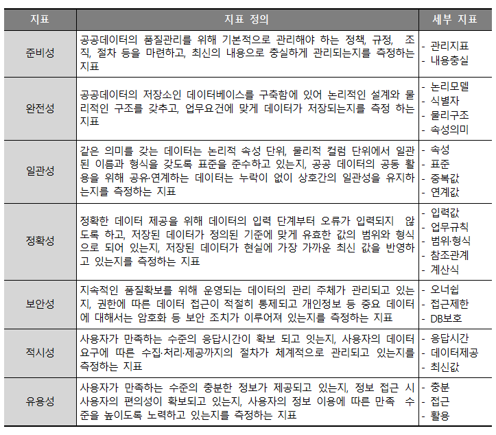

# 데이터 기반 행정

## 제1장 데이터 기반 행정의 필요성

### 개인과 조직의 관계 맺기

- 현대 사회의 사람들은 세상을 혼자서 살아갈 능력이 없습니다. 연령, 성별, 건강상태, 지능, 그리고 보유한 경제적 자산규모 등이 어떠한지와 관계없이 다른 사람의 도움이 없이는 생존 자체가 쉽지 않습니다. 기본적인 의식주부터 시작해서 의료, 치안, 교육, 경제, 여가 등 인간의 삶에 필요한 다양한 필수요소들은 모두 많은 수의 사람들이 협업해야만 나에게 제공될 수 있으며, 대부분의 경우 다른 사람의 도움을 받기 위해서는 그 대가로 돈이나 경제적 가치를 제공해야 합니다.
- 따라서 사람들은 다른 사람들과 서로 도움을 주고 받는 관계를 맺게 되고, 우리는 그것을 사회적 관계라고 부릅니다. 예전에는 가족, 친척, 이웃 등과 같은 주변 사람들과의 관계만으로 대부분의 일을 해결했지만, 사회가 점차 발달함에 따라 주변 사람과의 관계보다는 사회 내에 속한 조직과의 관계를 통해 더 많은 일을 해결하게 되었습니다.
- 개인이 조직과의 관계를 통해서 삶에 필요한 여러가지 서비스를 제공받게 되었습니다. 그런데 조직에 비해서 개인의 수가 훨씬 많기 때문에 조직은 각각의 개인들의 모든 요구사항을 만족시키는 것은 거의 불가능합니다. 개인들의 욕구는 너무나도 다양한 반면, 조직이 정해진 시간과 자원으로 생산할 수 있는 상품과 서비스는 한정되어 있기 때문입니다. 그래서 조직은 모든 개인에게 모든 형태의 도움을 주기보다는 특정한 개인에게 특정한 형태의 도움을 주고 그에 맞는 보상을 받는 형태로 변화하였습니다. 그 결과 현대 사회의 조직은 분야별로 전문화 되어있고, 그 분야의 전문성을 발휘하여 상품과 서비스를 제공하고 있습니다. 제조업체는 물건을 생산하고, 유통업체는 만들어진 물건은 수송하거나 판매하며, 관광업체는 관광서비스를 제공하고, 금융업체는 금융서비스를 제공합니다.
- 사회에는 다양한 조직이 존재하지만, 개인이 원하는 모든 서비스가 다 제공되는 것은 아닙니다. 특히, 서비스를 제공하기 위해 상당히 많은 준비과정이 필요한 반면 실제 그 서비스를 받으려는 사람이 적은 경우에는 서비스를 제공하는 사람이 없기 때문에 충분한 돈이 있더라도 서비스를 제공받을 수 없게 됩니다. 예를 들어 내가 아플 때 구급차가 집 앞으로 와서 병원까지 데려다주는 응급수송 서비스는 반드시 필요한 서비스이지만, 수요가 충분하지 않고, 서비스를 제공해야 하는 시간도 불규칙하기 때문에 민간조직이 제공하기에는 어려운 서비스입니다. 이와 같이 민간에서 제공하기 어려운 서비스나 인간의 삶을 유지하기 위해 가장 기본적으로 제공되어야 하는 서비스는 민간부문이 아니라 공공부문이 책임지고 제공해야 합니다. 즉 국가, 지방자치단체 또는 공공기관은 사회의 기초가 되는 서비스 또는 경제적인 원리에 의해 동작하는 시장을 통해서는 제공되지 않는 서비스를 제공하는 역할을 맡게 됩니다.
- 우리가 흔히 행정이라고 부르는 영역은 공공부문이 개인에게 제공하는 서비스 영역을 의미합니다. 그런데 민간부문의 서비스와 공공부문의 서비스에는 여러가지 차이점이 존재합니다.

### 공공부문의 서비스 만족도가 낮은 이유

- 개인이 공공부문의 조직과 민간부문의 조직에게 각각 서비스를 제공받으면서 두 서비스의 차이점을 느끼게 되었습니다. 즉 공공부문의 서비스는 민간부문의 서비스보다 불편하고, 답답하며, 비효율적이라는 인식이 널리 공유되었습니다. 이는 공공부문에서 제공되는 서비스가 삶을 유지해나가는데 반드시 필요한 서비스라는 측면을 고려해볼 때 매우 중요한 문제입니다.
- 공공부문의 서비스 만족도가 민간부문의 서비스 만족도보다 낮다는 것은 어찌보면 이상한 일입니다. 공공부문에서는 서비스를 제공하면서 돈을 받지 않는 경우가 대부분입니다. 실업급여처럼 돈 또는 상당한 가치의 경제적 이익을 제공받는 경우도 많습니다. 즉, 개인의 입장에서는 공짜로(또는 아주 저렴한 가격으로) 서비스를 제공받을 수 있다는 것입니다. 서비스를 받으려면 돈을 내야하는 민간 부문의 서비스보다 거의 무료로 제공되는 공공부문의 서비스에 대한 만족도가 낮다니 이상하지 않습니까? 이러한 차이를 이해하기 위해서는 민간부문의 서비스와 공공부문의 서비스 차이를 살펴보아야 합니다.
- 서비스를 제공하는 데 있어 민간부문과 공공부문의 첫 번째 차이는 서비스를 제공받는 대상에게 선택권이 존재하는지 여부입니다. 우리가 민간부문의 대표적인 서비스인 음식배달 서비스를 이용하기 전에 하는 행위는 서비스 제공자를 고르는 것입니다. 즉, 공개된 정보에 따라 나의 마음에 드는 서비스 제공자를 고르고 그 다음에 서비스를 제공받게 됩니다. 반면 공공부문의 서비스는 선택권이 존재하지 않는 경우가 대부분입니다. 내가 사는 지역의 자치단체, 교육청, 경찰서, 고용센터는 모두 하나 뿐입니다. 다른 기관을 선택할 여지가 없기 때문에 정해진 기관에서 서비스를 제공받아야만 합니다.
- 민간부문의 서비스를 제공받을 때 필수적으로 거쳐야 하는 선택의 과정은 개인의 시간과 노력이 들어가기 때문에 서비스를 제공받는 입장에서는 번거로운 과정인 것처럼 보이지만, 한 가지 부수적인 효과가 있습니다. 사람들은 자신의 선택을 합리화하려는 경향이 있기 때문에 자신이 서비스 제공자를 고른 이후에는 서비스 제공자의 입장과 자신의 입장이 동기화되는 심리적인 효과가 있습니다. 예를 들어 우리가 인터넷 검색을 통해 어떤 물건을 주문했는데 친구가 거기보다 더 싸게 살 수 있는 사이트가 있다고 알려주면 우리는 주문을 취소하고 적은 돈이라도 아낄 수 있는 다른 사이트에서 다시 주문하기보다(그것이 경제적으로 합리적인 선택임에도!) 내가 주문한 사이트가 더 믿을 만한 사이트라고 생각하는 방식으로 이미 선택된 인터넷 판매자의 입장을 대변하게 됩니다. 즉, 선택의 과정이 다소 잘못되었더라도 자신의 선택을 합리화하기 위해서 서비스 품질에 대해 좀 더 후한 평가를 하도록 만듭니다.
- 민간부문 서비스가 공공부문 서비스와 다른 두 번째 차이점은 서비스 제공대상이 선별적이라는 점입니다. 민간부문의 서비스는 특정한 목표를 가진 특정한 사람들만을 대상으로 합니다. 자전거를 파는 민간기업이 있다고 가정해봅시다. 이 기업의 서비스를 이용하는 사람은 자전거를 사고 싶은 사람들 뿐입니다. 반면 공공부문에서 제공하는 서비스 대상은 민간부문의 대상보다 훨씬 더 광범위합니다. 공공부문의 이동 서비스는 자전거 뿐만 아니라, 걷기, 달리기, 전동킥보드, 대중교통, 자가용 등 다양한 방법으로 이동하려는 사람들을 모두 대상으로 합니다. 서비스 제공 대상이 광범위하다는 것은 맞춤 서비스를 제공하기 어렵다는 것을 의미합니다. 공공부문은 많은 수의 사람들이 원하는 몇 가지 유형의 서비스를 제공할 뿐, 개인의 특성에 맞는 서비스를 제공하는데 있어서는 어려움을 겪습니다.
- 식당에 들어온 사람은 배고픈 사람이고, 편의점에 들어온 사람은 물건을 사러온 사람입니다. 하지만 동사무소에 들어온 사람은 무엇을 원하는 사람인지 알기 어렵습니다. 그래서 그 사람이 어떤 사람인지를 알기 위해서 서비스를 신청하는 단계에서 다양한 자료를 요구합니다. 하지만 이미 많은 민간 조직에서 돈을 지불하는 한 가지 행동만으로 자신의 요구를 충족시켜 왔던 많은 사람들에게 이 과정은 불필요하게 생각되는 거추장스러운 절차일 뿐입니다. 이미 서비스를 제공하기 전에 신청을 받는 단계에서부터 부정적인 경험을 하게 되는 것입니다.
- 아울러 서비스를 제공받는 방법도 제한적입니다. 공공부문의 서비스는 사전에 정해진 특정한 방법으로만 서비스를 제공해주는 경우가 많습니다. 예를 들어, 실업급여를 받으려면 완전히 실업한 상태에서 실업급여를 100% 받아야만 합니다. 국가에 부담을 주지 않기 위해서 실업급여를 절반만 받고 부족한 소득을 보충하기 위해 알바 일을 하는 것은 허용되지 않습니다. 이러한 예는 수없이 많습니다. 공공부문의 서비스는 정해진 방법으로만 제공받을 수 있습니다. 비록 개인의 요구가 충족된다고 하더라도 불만을 가지게 되는 사람이 늘어납니다.
- 세 번째 차이는 고객이 느끼는 만족도가 서비스를 제공하는 담당자 또는 실무자에게 영향을 미치는지 여부가 다르다는 것입니다. 민간부문에서 서비스를 제공하는 담당자, 실무자들은 서비스를 원하는 사람이 많아서 더 많은 서비스를 제공할수록 경제적 보상을 기대할 수 있습니다. 물론 직원들에게 일을 굉장히 많이 시키면서도 같은 임금만 주는 사례도 있지만 그러한 기업은 오래 지속되기 어렵습니다. 즉, 공공부문과 비교하면 민간부문은 서비스가 성공할수록 담당자 또는 실무자에게 더 많은 경제적 보상을 주는 경향이 있습니다. 반면 공공부문은 서비스 수요가 급증하더라도 담당자에게 경제적 보상을 해주는 경우는 거의 없습니다. 서비스 수요가 장기간 동안 늘어날 경우에만 아주 적은 수의 인력 충원을 실시할 뿐입니다.

### 공공부문 서비스 품질을 개선하려면

- 공공부문의 서비스 품질을 높이려면 공공부문의 조직을 민간부문처럼 바꿔야 할까요? 물론 그렇게 생각하는 사람도 있지만, 저는 그 방법이 위험하다고 생각합니다. 왜냐하면 민간부문과 공공부문은 서로 지향하는 바가 다르기 때문입니다. 대부분의 민간부문 조직은 서비스를 제공하면서 사람들에게 받는 경제적 대가를 최대화하는 것을 목표로 합니다. 모든 사람에게 공평하게 자원을 배분하거나, 취약한 계층의 사람에게 더 많은 자원을 배분하는 것을 목표로 하지 않습니다. 또한 중장기적으로 삶을 유지하는데 꼭 필요한 서비스보다도 사람들이 단기적으로 원하는 서비스를 제공하는 데 집중합니다. 민간부문의 조직은 그러한 목표를 달성하기 위한 구조와 작동방식을 가지고 있습니다. 따라서 공공부문 조직을 민간부문처럼 바꾸는 것은 좋은 방법이 아닐 수 있습니다.
- 공공부문 조직이 더 나은 서비스를 제공하기 위해서는 공공부문 조직이 가지고 있는 강점을 활용해야 합니다. 공공부문 조직이 가지고 있는 강점은 광범위한 서비스 대상에게 아주 다양한 서비스를 제공한다는 점과 그러한 서비스를 제공하는 실무자가 경제적 보상이 아니라 행정적 책임에 근거하여 행동한다는 점입니다. 이 세 가지가 공공부문의 서비스 품질이 낮을 수 밖에 없는 이유라는 점에서 당혹스러울 수 있을 것입니다. 하지만 앞서 이야기한 바와 같이 이는 서비스 품질을 낮추는 요인이 될 수도 있지만, 다르게 생각하면 공공부문 서비스 품질을 높일 수 있는 강력한 무기가 될 수도 있습니다.
- 서비스 대상이 광범위하다는 것은 서비스 수요 데이터를 수집할 수 있는 대상자가 더 많다는 것을 의미합니다. 사회를 구성하는 사람들이 원하는 바를 좀 더 자세히 그리고 정확히 파악할 수 있는 것입니다. 제공하는 서비스가 다양하다는 것은 서비스 사이의 연관관계를 좀 더 잘 이해할 수 있는 바탕이 됩니다. 실업급여와 직업훈련, 취업지원 서비스를 제공받는 사람이 각각 몇 명인지 아는 것보다는 실업급여를 받은 사람 중에서 얼마나 많은 사람이 직업훈련을 받고 그 중에 몇 명이 취업에 성공했는지를 아는 것이 훨씬 더 가치있는 정보가 됩니다. 담당자들이 경제적 보상이 아니라 행정적 책임에 근거하여 행동한다는 것은 사람들의 행동을 보다 객관적으로 파악할 수 있는데 도움을 줍니다. 사람들이 특정한 방향으로 행동해야만 더 많은 보수를 받을 수 있는 사람들이 입력하는 데이터는 현실을 왜곡시켜서 보여줄 가능성이 높기 때문입니다.
- 공공부문이 가지는 한계를 반대로 강점으로 활용하기 위해서 필요한 것이 한 가지 있습니다. 그것은 바로 데이터를 행정에 활용할 수 있는 조직의 능력입니다. 즉, 공공부문 조직이 데이터를 행정에 활용할 수 있다면 광범위한 서비스 대상, 다양한 서비스 종류, 행정적 책임에 따라 행동하는 담당자가 강점으로 작용할 수 있지만, 그렇지 못하다면 이 세 가지 특징은 행정 서비스의 만족도를 낮추는 약점으로 작용할 가능성이 높습니다.
- 공공부문 조직의 세 가지 특징을 활용하기에 앞서 먼저 알아야 할 것이 있습니다. 데이터를 행정에 활용한다는 것은 어떤 의미인지에 대해 먼저 이해해야 합니다.

## 제2장 데이터는 어떻게 활용되어야 하는가?

### 데이터의 의미

- 데이터는 자료일 뿐, 그 자체로는 의미가 없습니다. 데이터는 어떠한 목적을 가지고 분석된 후에야 의미를 가질 수 있습니다. 즉, 데이터에서 가치있는 정보를 찾아내는 과정이 필요합니다. 그래서 데이터를 활용한다는 말은 데이터에서 정보를 찾아내고, 그 정보를 의사결정에 활용한다는 말을 줄여서 표현한 것이라고 할 수 있습니다. 
- 데이터는 모든 상황에서 만들어질 수 있지만, 우리가 관심을 가지는 데이터는 대개 사람의 행동이나 사회·자연의 변화와 관련된 데이터입니다. 우리가 스마트폰으로 인터넷을 할 때, 교통카드로 버스를 탈 때, 편의점에서 물건을 살 때, 자동차 네이게이션으로 목적지를 안내받을 때 등 우리가 하는 행동은 모두 데이터가 될 수 있습니다. 또한, 최고기온과 최저기온, 강수량, 주가지수, 석유나 구리의 가격, 코로나-19 확진자 수, 교통사고 사망자수 등과 같이 자연과 사회의 상황은 데이터로 기록되고 저장될 수 있습니다.
- 행정 서비스를 제공하는데 있어서는 주로 정책대상과 담당자의 행동을 기록한 데이터를 다루게 됩니다. 예를 들어 "김고용"이라는 사람이 취업을 위해서 내일배움카드를 발급받아 직업훈련을 받고, 취업성공패키지 프로그램을 통해 취업에 성공했다고 한다면, 그 과정에서 수 많은 데이터들이 생성됩니다. 내일배움카드를 신청한 자료, 내일배움카드를 발급받은 자료, 내일배움카드로 직업훈련 프로그램을 신청한 자료, 직업훈련 프로그램을 이수한 자료, 취업성공패키지를 신청한 자료, 취업성공패키지를 통해 취업상담을 받은 자료, 자신이 원하는 기업을 검색한 자료, 워크넷을 통해 이력서를 제출한 자료, 취업에 성공하여 고용보험 및 산재보험에 가입한 자료, 그리고 실제로 보수를 지급받은 자료 등이 생성됩니다. 물론 이 자료들 말고도 더 많은 자료들이 생성되며, 그 자료들의 내용은 매우 방대할 것입니다.
- 김고용 씨에 대한 자료들을 천천히 살펴보면 그것이 김고용 씨에 대한 자료이기도 하지만, 김고용 씨에게 서비스를 제공해온 정부기관의 업무에 대한 자료이기도 하다는 것을 알 수 있습니다. 즉, 자료는 하나의 성격만을 가지고 있지 않습니다. 그것은 김고용 씨의 취업과정을 설명해주기도 하지만, 고용노동부가 김고용 씨에게 어떤 서비스를 제공했는지도 설명해 줄 수 있습니다. 또 20대 청년 구직자의 현실을 알려주는 데이터가 될 수도 있습니다. 데이터는 그 자체로는 의미가 없기 때문에 그 데이터가 어떤 의미를 가지는지는 데이터를 분석하는 사람에게 달려있습니다.

### 좋은 데이터

- 데이터를 분석하는 사람은 데이터에 의미를 부여하기 위해 노력합니다. 그런데, 어떤 데이터는 그러한 작업이 쉽게 이루어질 수 있는 반면, 어떤 데이터는 아무리 노력해도 의미를 부여하기 어려운 경우가 있습니다. 즉, 데이터의 품질에는 차이가 존재합니다. 그렇다면 어떤 데이터가 좋은 데이터, 높은 품질의 데이터라고 할 수 있을까요?
- 어떤 데이터가 좋은 데이터인지를 판단하는 기준에 대해 미리 고민한 사람들이 있었습니다. '데이터품질관리'라는 학문의 한 분야가 될 정도로 연구가 이뤄졌습니다. 행정안전부는 공공데이터 품질관리 매뉴얼을 작성하여 공공부문에서 생산되는 데이터의 품질을 판단하는 기준을 준비성, 완전성, 일관성, 정확성, 보안성, 적시성, 유용성의 7대 지표로 제시하고 있습니다.

- 우리가 이 지표의 내용을 다 알아야 하는 것은 아니지만, 그 중에서 완전성, 일관성, 정확성에 대해서는 조금 더 자세히 알아볼 필요가 있습니다.
- 완전성은 데이터베이스가 업무 내용을 제대로 반영할 수 있도록 설계되었는지를 평가하는 품질 지표라고 할 수 있습니다. 예를 들어 고용유지지원금 자료를 데이터베이스에 저장하기 위해 데이터베이스를 설계한다고 생각해봅시다. 단순히 지원을 받은 사업장명과 사업장관리번호, 그리고 지원한 금액 정보를 데이터베이스에 기록할 수 있도록 했다면, 업무 내용을 제대로 반영한 것일까요? 그렇지 않을 가능성이 높습니다. 지원을 받은 사업장과 지원금액만 기록한다면 지원금을 신청했지만 받지 못한 사업장이 어떤 사업장인지 알 수 없을 것입니다. 지원금을 신청한 사업장이 지원 요건을 충족하는지 검토하는 일은 지원금 업무의 중요한 부분이기 때문에 지원여부를 심사한 결과도 데이터로 기록할 수 있어야 합니다. '지원받은 사업장명, 사업장관리번호, 지원금액만' 기록하는 것보다 '신청한 사업장명, 사업장관리번호, 지원대상여부, 신청금액, 지원금액'까지 기록하는 것이 더 나은 품질의 데이터가 될 가능성이 높은 것입니다.
- 물론 업무에서 이뤄지는 모든 일을 데이터베이스에 저장할 수는 없습니다. 그렇지만 업무의 핵심적인 부분, 정책 결정을 위해 필요한 정보들을 데이터베이스에 저장되어 있어야 합니다. 그래서 업무시스템을 만드는 IT 엔지니어들은 반드시 오랜 시간 업무를 해온 담당자들과 인터뷰를 한 다음에야 시스템을 만드는 작업을 시작합니다. 무엇이 중요한 정보인지 가장 잘 알고 있는 사람은 담당자이기 때문입니다.
- 일관성은 데이터베이스에 저장된 값이 일관성을 유지하고 있는지를 판단하는 지표입니다. 일관성이 지켜지지 않는 대표적인 사례 중 하나는 주식회사의 이름을 각각 다르게 입력하는 것입니다. SK 하이닉스 주식회사를 에스케이하이닉스(주), SK하이닉스주식회사, ㈜SK Hynix 등과 같이 제각기 다른 방식으로 SK 하이닉스 주식회사와 관련된 정보를 한 번에 불러오기 어려울 것입니다. 회사 이름이 몇 개 되지 않을 때에는 직접 수정할 수 있지만, 500만개의 사업장 이름이 규칙없이 적혀있다면 데이터 분석을 포기할 수 밖에 없을 것입니다. 데이터의 품질이 낮기 때문에 데이터를 활용할 수 없는 것입니다.
- 데이터의 일관성을 유지하기 위해서는 키 값이 제대로 관리되어야 합니다. 데이터의 키 값은 그 데이터를 식별할 수 있는 하나의 숫자열 또는 문자열입니다. 사람으로서 예를 들자면 키 값이 무엇일까요? 주민등록번호가 가장 키 값에 가깝습니다. 이름이나 이메일주소, 휴대폰번호는 다른 사람과 같거나 쉽게 변할 수 있기 때문에 데이터가 나타내는 대상을 특정하기에 적합하지 않은 자료입니다. 자료가 가리키는 대상이 사람인 경우에는 주민등록번호, 기업인 경우에는 법인등록번호나, 사업자등록번호와 같은 키 값을 활용하는 경우가 많습니다. 그리고 대용량의 데이터를 관리해야 하는 경우 각 기관마다 고유한 키 값을 생성하여 부여하기도 합니다.
- 정확성은 입력된 데이터에 오류가 있는지를 판단하는 품질 지표입니다. 오류에는 형식적인 오류와 논리적인 오류가 있는데, 형식적인 오류는 데이터 입력 형식을 지키지 않은 데이터입니다. 나이를 입력해야 하는 곳에 이름이 입력되어 있다거나, 출생 지역을 입력해야 하는 곳에 전화번호가 입력되어 있는 경우는 형식적인 오류라고 할 수 있습니다. 논리적인 오류는 나이에 377과 같은 터무니 없는 수가 입력되어 있거나, 시험 성적을 입력했는데 학점 계산이 잘못된 경우, 지원금을 신청한 날보다 지원받은 날짜가 더 빠른 경우 등 입니다.
- 정확성이 낮아지는 이유는 보통 시스템 개발 기간이 너무 짧아서 입력 값을 검증하는 절차가 생략하기 때문입니다. 업무시스템에서 지원금을 입력하는 칸에 음수를 입력하거나 터무니 없이 큰 숫자를 입력해도 경고창이 뜨지 않고 입력이 이뤄진다면 시스템이 입력 값을 제대로 검증하지 않고 있을 가능성이 높습니다. 입력 값을 검증하지 않으면 아무 값이나 입력할 수 있어서 당장은 편할 수 있지만, 나중에 데이터를 활용하여 의사결정을 하려고 할 때 데이터 전체를 사용할 수 없어집니다.
- 완전성, 일관성, 정확성 외에도 많은 지표가 있기 때문에 데이터를 사용하는 각 기관은 대부분 데이터 품질을 관리하기 위해 지표를 정하고, 별도의 관리부서를 두고 있습니다. 하지만, 데이터 품질은 IT 부서만 노력해서 향상 시킬 수 있는 지표가 아닙니다. 현업에서 업무를 수행하는 부서에서도 데이터 품질이 중요하다는 인식이 공유되어야만 데이터 품질이 향상될 수 있습니다.

### 좋은 데이터가 조직에 주는 영향

- 좋은 품질의 데이터는 데이터 분석을 쉽게 해줄 뿐만 아니라 조직에도 긍정적인 영향을 줄 수 있습니다. 조직이 생산하는 데이터의 품질이 좋다는 것은 그 조직의 조직원들이 업무 현장에서 하는 일이 대부분 정확하게 데이터로 기록된다는 것을 의미합니다. 즉, 조직원들의 경험이 데이터 형태로 조직에 축적되는 것입니다. 이제 조직은 축적된 데이터를 활용하여 성과를 공정하게 평가하고, 더 나은 업무 방식을 보다 쉽게 찾아낼 수 있습니다. 데이터가 조직에 미치는 긍정적인 효과가 반복되면 그 조직은 다른 조직에 비해서 성과를 더 잘 내는 조직이 될 것입니다.
- 반대로 조직이 데이터를 제대로 관리하지 못하면 같은 실수를 반복하게 됩니다. 조직원 중에 누가 좋은 성과를 내고 있는지 알지 못하고, 간혹 우연히 조직이 좋은 성과를 내더라도 그 원인이 무엇인지 알지 못하게 됩니다. 즉, 시험을 반복해서 보지만 자신이 푼 문제가 맞았는지 틀렸는지 피드백을 받지 못하는 학생처럼 그저 관행과 직감에 의존해 일을 반복할 수 밖에 없습니다.
- 그래서 좋은 데이터는 데이터분석가 뿐만 아니라 실제로 그 데이터를 생산해내는 대부분의 조직원들에게도 중요합니다. 그리고 데이터 품질을 향상시키기 위해서는 데이터 품질이 무엇이고, 어떤 방법으로 그것을 향상시킬 수 있는지에 대한 생각이 공유되어야만 합니다.

### 데이터 분석 절차

#### 1. 문제 정의

- 데이터 분석의 시작은 어떤 문제를 해결하기 위해 데이터를 분석할 것인지를 정하는 것입니다. 즉, 문제를 정의하는 것입니다. 정책적인 측면으로만 한정하더라도 데이터를 분석하려는 목적은 매우 다양합니다. 정책의 효과성을 높이기 위해서, 정책을 집행하는데 필요한 시간과 자원을 줄이기 위해서, 정책을 보다 많은 사람에게 알리기 위해서, 정책을 악용하는 사람들을 줄이기 위해서, 새로운 정책을 개발하기 위해서 등 다양한 목적을 달성하기 위해 데이터를 분석합니다.
- 문제를 정의하는 단계는 데이터 분석의 방향을 정하는 것이기 때문에 이후 데이터 분석에 사용하는 시간과 노력이 얼마나 가치있을지를 결정하는 중요한 역할을 합니다. 문제를 잘 정의하기 위해서는 이후 단계들에서 어떤 일이 벌어질 것인지를 예측할 수 있어야 합니다. 데이터 수집이 불가능한 문제, 데이터 모델을 만들기 어려운 문제, 문제를 발견하더라도 해결책을 제시하기 어려운 문제를 정의하면 아무리 많은 시간을 들이더라도 데이터 분석의 효과를 체감하기 어렵습니다.
- 경험이 많지 않은 데이터분석가들이 많이 하는 실수는 상당히 오랜 시간의 분석 끝에 이미 알려진 결론을 도출하는 것입니다. 즉, 뻔한 이야기를 하는 것입니다. 그런 실수를 하는 이유는 데이터분석가들이 현장에서 일하는 업무 담당자들의 이야기를 듣고 그것만을 바탕으로 문제를 정의하기 때문입니다. 현장의 담당자들이 하는 이야기로부터 많은 통찰을 얻을 수 있지만, 그 이야기만으로 주제를 선정하면 데이터 분석 결과는 현장 담당자들이 가진 생각 또는 예측을 데이터로 뒷받침하게 됩니다. 그 분석 결과를 본 현장 담당자들은 "아니... 힘들게 분석을 해서 멋진 통계와 그래프를 만든 것은 좋지만, 이건 우리가 다 아는 내용인데요?" 이라고 말하는데, 그것만큼 허탈한 일도 없습니다. 그런 실패를 피하기 위해서는 현장 담당자들의 이야기 뿐만 아니라 정책에 대한 고민이 더해져야 합니다. 현장 담당자들의 시각을 뛰어넘어 창의적인 관점에서 문제를 바라보고, 그러한 시각을 통해 새로운 해결방법을 제시하는 것이 데이터 분석가의 역할이라 할 수 있습니다.
- 하지만 적절한 문제를 정의하는 것은 결코 쉽지 않은 일이고, 많은 실패 경험이 없이는 성공적으로 문제를 정의하기 어렵습니다. 이것을 극복하기 위해서 여러분께 드릴 수 있는 조언은 실패를 두려워하지 말고, 데이터 분석에 도전해보라는 것 뿐입니다.

#### 2. 데이터 수집 & 전처리

- 데이터 수집과 전처리(Pre-processing) 단계는 실질적으로 데이터 분석이 시작되는 단계이면서, 가장 시간이 오래 걸리는 단계입니다. 데이터 분석에 5주가 걸린다면 데이터 수집과 분석에 4주 정도가 필요합니다. 다르게 말하면 데이터 수집과 전처리가 끝난 상황이라면 데이터 분석은 마무리 단계에 접어들었다고 볼 수 있습니다.
- 데이터 수집 방법에는 이미 구축된 데이터를 찾는 방법과 새로운 데이터를 만드는 방법이 있습니다. 카카오나 네이버, 구글, 아마존과 같은 플랫폼 기업 뿐만 아니라 상당히 많은 기업들이 데이터를 생산하고 있으며 정부기관도 아주 다양한 데이터를 많이 생산하고 있습니다. 하지만 데이터를 만드는 데에는 한계가 있기 마련이며 대부분의 데이터는 조직 외부로부터 구하게 됩니다. 외부 데이터를 데이터분석에 활용하기 위해서는 우선 그 데이터가 어디에 어떻게 존재하는지를 알아야 하고, 그 데이터를 입수할 수 있는 수단이 필요합니다. 정부부처의 경우에는 데이터 제공을 요청할 수 있는 법률 조항이나 데이터를 구매할 수 있는 예산이 있어야 데이터를 수집할 수 있는 경우가 많습니다. 최근에는 데이터 활용이 늘어나면서 공공데이터포털이나 행정정보공동이용센터와 같은 데이터 플랫폼을 이용하여 데이터를 수집하는 사례도 빠르게 증가하고 있습니다.
- 수집된 데이터를 바로 데이터 분석에 활용하는 경우는 아주 드뭅니다. 대부분의 경우 데이터는 분석에 적합하지 않은 형태이고, 오류도 많이 존재하기 때문에 데이터의 오류를 수정하고 원하는 형태의 데이터로 변환하는 데이터 전처리 작업은 데이터 분석을 위해 아주 필수적인 작업입니다. 데이터 전처리를 위해서는 SQL, Python, R, Stata와 같은 프로그래밍 언어를 사용해야 하지만 데이터의 크기가 작은 경우(최대 100만건 이하) 엑셀과 같은 스프레드시트 프로그램을 통해 전처리를 하는 것도 가능합니다.
- 제가 경험한 바에 따르면 전산시스템을 통해 입력된 데이터라 하더라도 날짜 입력 오류, 중복된 키 값, 범위를 초과하는 숫자값, 불필요한 문자가 포함된 문자열, 예상되지 않은 입력값 등 수 많은 오류가 존재하며, 데이터 분석을 위해서는 그러한 오류들을 각각 어떻게 처리할 것인지에 대한 의사결정이 필요합니다. 그러한 의사결정에 정답은 없다는 것이 가장 힘든 점이며, 판단하기 힘든 문제들을 반복적으로 해결하는 데이터 분석가가 현장 담당자보다 업무의 실상을 더 자세히 알게되는 경우도 자주 발생합니다.

#### 3. 데이터 분석 & 시각화

- 좁은 의미의 데이터 분석은 모델링이라고도 하는데, 우리가 수집하고 전처리한 데이터들 사이에 어떤 관계가 있는지를 찾아내는 단계입니다. 여러 데이터 사이의 관계를 알아내기 위해서는 테이블을 합치거나 관계를 부여하여야 합니다. 예를 들어 학생들의 시험성적 점수와 학생들의 공부시간과 수면시간 데이터가 있을 때 학생의 이름이나 학번을 기준으로 시험성적 점수와 공부시간, 수면시간 데이터를 연결해야 공부시간, 수면시간에 따른 점수의 변화를 파악할 수 있을 것입니다. 시험성적에 대한 이 간단한 분석보다는 훨씬 더 복잡하고 예외가 많다는 것을 빼면 기본적으로 데이터 모델링은 데이터 간의 관계를 정의하고, 그것을 검증해보는 과정의 반복이라 할 수 있습니다.
- 분석 과정에서 범하기 쉬운 실수는 데이터의 범위까지만 분석을 하는 실수입니다. 데이터 수집이 충분하지 못한 상황에서 분석을 시작해야 하는 경우가 많은데, 분석 결과는 어떤 가설을 지지하거나 반증할 뿐 그 구체적인 이유는 분석가가 생각해내야 하는 영역입니다. 그런데 데이터가 없다는 이유로 근본적인 원인까지 분석하지 않고 분석을 멈춰버려서는 안됩니다. 즉, 시험성적 점수와 학생들의 공부시간 사이의 상관관계가 있다는 가설을 검증하기 위해 데이터 분석을 하는 경우, 공부시간이 길수록 시험성적이 높아지는 경향을 보인다는 분석에서 멈춰서는 안된다는 것입니다. 특정 집단의 학생들이 다른 집단의 학생들보다 더 공부한 시간이 많은 이유가 무엇인지까지 분석을 해야 하는 것입니다. 부모의 학력이 높거나 독서량이 많기 때문인지, 유튜브와 같은 영상매체를 보는 시간이 적어서인지, 선생님이 학습 동기부여를 잘 해서인지, 건강상태가 좋아서인지 등 다양한 이유가 있을 수 있습니다. 하지만 그와 관련된 데이터가 없다는 이유로 분석을 멈추게 되면 결론은 "공부를 오래하면 성적이 올라간다"는 단순한 결론 밖에 도출해낼 수 없습니다. 데이터 분석이 종료되는 지점은 내가 가지고 있는 데이터가 더 이상 없는 곳이 아니라 스스로 더 이상 궁금한 것이 없는 곳이 되어야 합니다. 물론 시간이나 분석능력의 한계 때문에 근본적인 해답에 도달하지 못하는 때가 많습니다. 그렇다고 하더라도 데이터가 있는지 없는지에 따라 데이터 분석의 범위를 결정하는 것은 훌륭한 데이터 분석가의 태도라고 보기 어렵습니다.
- 데이터 시각화는 분석한 결과를 쉽게 이해할 수 있도록 그래프나 그림을 만드는 작업입니다. 데이터 시각화는 데이터 분석에 익숙하지 않은 다수의 사람들에 분석결과를 효과적으로 전달하기 위해 꼭 필요하며, 때로는 데이터를 분석하는 것보다 어떻게 사람들에게 잘 전달하는지가 더 중요할 때가 있습니다. 예전에는 일일이 그래프를 그려야 했지만 최근에는 시각화 프로그램이 많이 출시되었기 때문에 분석된 데이터만 있다면 쉽게 시각화를 할 수 있습니다.
- 데이터를 시각화할 때 얼마나 많은 그래프를 그리는가는 중요하지 않습니다. 분석가가 전달하고 싶은 내용을 스토리텔링의 형태로 전달할 수 있다면 그래프가 몇 개인지는 중요하지 않습니다. 문제는 데이터가 감추고 있는 의미를 어떻게 하면 정책과 그 데이터에 익숙하지 않은 사람들에게 잘 전달하는지 여부 입니다. 가장 어리석은 데이터 시각화 방법은 필요할지도 모르는 모든 그래프를 그려둔 다음에 사람들이 그 안에서 의미를 찾을 수 있을 것이라고 기대하는 것입니다.

#### 4. 적용 및 환류

- 데이터 분석은 아직 끝나지 않았습니다. 데이터 분석은 그 결과를 현실에 적용하고, 그 결과를 반영하여 다시 데이터 분석을 하는 환류 과정까지를 포함합니다. 데이터 분석 결과를 적용하려면 현실의 제도나 일하는 방식을 바꿔야 합니다. 사실 데이터 분석에 있어 가장 어려운 부분이 이 "적용" 부분입니다. 적용 부분이 어려운 이유는 데이터 분석가 혼자서 할 수 있는 일이 아니라 다른 사람들과 함께 해야하는 일이기 때문입니다. 데이터 분석을 현실에 적용하려면 신뢰할 수 있는 동료들이 필요하며 그런 동료가 없다면 적어도 제도를 바꿀 수 있는 권한이라도 있어야 합니다. 그렇지만 자신이 행동하는 이유를 모른 상태에서 성과를 내는 것은 아주 어려운 일이기 때문에 데이터 분석의 결과를 현장 담당자에게 제대로 전달하는 것이 적용 단계의 가장 핵심적인 과제입니다.
- 데이터를 분석하면 그 과정에 많은 노하우를 얻게 됩니다. 수집할 수 있는 데이터에는 어떤 것들이 있는지, 데이터 품질은 양호한지 미흡한지, 데이터 분석 결과 드러난 문제점이 무엇인지, 데이터를 바라보는 사람들의 시각은 어떠한지 등을 알게 되었다면 데이터 분석을 향상시킬 준비가 된 것입니다. 분석에 필요한 더 많은 데이터를 수집하거나, 다른 분석 방법을 시도하거나, 좀 더 효과적인 시각화방법을 활용하거나, 분석 결과를 다른 관점에서 적용하거나 또는 더 이상 데이터 분석이 필요하지 않다는 의사결정을 할 수도 있습니다. 어떤 것이든 이전에 시도했던 데이터 분석보다 더 높은 수준의 데이터 분석이 될 가능성이 높으며, 이러한 과정이 반복될 수록 데이터 분석가와 조직의 역량이 향상될 것으로 기대할 수 있습니다.

### 데이터를 활용한다는 것

- 데이터 활용은 조직의 성과를 향상시키고, 역량을 키우는 것과 직결됩니다. 조직의 현장 직원들의 행동은 데이터로 기록되며, 그 데이터를 활용하지 않으면 조직원들이 겪는 경험과 시행착오는 조직의 역량으로 전환되지 못하고 사라져버리게 됩니다. 반대로 그 데이터를 활용하는 것은 현장의 경험이 조직 전체의 역량 강화의 원동력이 될 수 있도록 현장의 경험과 조직의 역량을 연결하는 것과 같습니다. 
- 어떤 일을 할 때 초기에는 여러 가지 이유로 앞서 있던 조직이라 할 지라도 현장의 경험을 데이터로 기록하고, 기록된 데이터로 다시 조직의 역량을 강화시키지 못한다면 곧 다른 조직에 비해서 뒤처질 수 밖에 없을 것입니다. 그것이 빠르게 변하는 현대 사회에서 데이터가 중요한 이유라고 생각합니다.

## 제3장 데이터 기반 행정의 실제

- 공공부문에서 데이터를 활용하여 더 나은 품질의 행정 서비스를 제공하는 것이 데이터 기반 행정이라고 할 수 있습니다. 제1장에서는 데이터 기반 행정이 필요한 이유에 대해 알아보았고, 제2장에서는 데이터를 어떻게 활용하는지, 그리고 데이터를 활용한다는 것이 어떤 의미인지에 대해 알아보았습니다. 그런데, 아직 중요한 문제가 남아있습니다. 그래서 도대체 데이터 기반 행정을 하려면 구체적으로 무엇이 필요한지 알아야합니다.

### 1. 법령 체계

- 데이터 기반 행정을 위해 첫 번째로 하는 이야기가 법령에 대한 이야기라니 당황스러울 수도 있습니다. 하지만, 많은 조직들이 데이터 기반 행정을 시작하지 못하는 이유는 법령 체계가 미비하기 때문입니다. 데이터 기반 행정은 다르게 보면 개인에 대해 맞춤형 서비스라고 표현할 수도 있는데, 맞춤형 서비스를 위해서는 상당히 많은 양의 개인정보를 다루어야 합니다. 따라서 개인정보를 다룰 수 있는 법령 체계가 갖춰져 있지 않다면 데이터 기반 행정을 시작할 수 없습니다.

#### 수집할 수 있는 데이터와 수집할 수 없는 데이터

- 세상에는 수없이 많은 데이터가 존재하지만, 그 데이터들을 모두 수집할 수 있는 것은 아닙니다. 대부분의 경우 데이터에는 '정보주체'라고 불리는 주인이 있고, 그 주인(정보주체)의 허락이 있어야만 데이터를 수집할 수 있습니다. 정보주체의 허락과 관계없이 데이터를 수집하는 방법은 정보주체가 되는 것입니다. 즉, 스스로 데이터를 생산하는 것입니다. 데이터를 스스로 생산하는 것이 개인에게는 매우 어려운 일이지만, 큰 조직의 경우 업무 시스템을 잘 갖추는 것 만으로도 상당히 많은 양의 데이터를 생산해 낼 수 있습니다. 데이터를 스스로 생산하면 활용 목적에 맞게 데이터가 생산되도록 설계할 수 있다는 장점도 있습니다. 하지만 역시 데이터 생산에는 상당한 시간과 비용이 필요하기 때문에 스스로 데이터를 생산해낼 수 있는 조직이라 하더라도 대부분의 데이터는 조직 외부에서 수집하게 됩니다.
- 외부에 존재하는 데이터라고 할지라도 데이터를 수집할 수 없는 경우가 많은데, 대부분의 경우 개인정보보호 때문입니다.

#### 수집할 수 없는 데이터: 개인정보

- 외부에서 데이터를 수집할 때 가장 먼저 고려해야 하는 것은 데이터 수집행위가 개인정보보호법에 위반되지 않는지 여부입니다. 개인정보보호법은 개인정보의 범위와 개인정보의 보호를 위해 개인정보처리자가 지켜야 할 사항을 정하고 있습니다.

> 개인정보보호법 제2조(정의)
> 1. "개인정보"란 살아 있는 개인에 관한 정보로서 다음 각 목의 어느 하나에 해당하는 정보를 말한다.  
>   - 가. 성명, 주민등록번호 및 영상 등을 통하여 개인을 알아볼 수 있는 정보  
>   - 나. 해당 정보만으로는 특정 개인을 알아볼 수 없더라도 다른 정보와 쉽게 결합하여 알아볼 수 있는 정보. 이 경우 쉽게 결합할 수 있는지 여부는 다른 정보의 입수 가능성 등 개인을 알아보는 데 소요되는 시간, 비용, 기술 등을 합리적으로 고려하여야 한다.  
>   - 다. 가목 또는 나목을 제1호의2에 따라 가명처리함으로써 원래의 상태로 복원하기 위한 추가 정보의 사용ㆍ결합 없이는 특정 개인을 알아볼 수 없는 정보(이하 “가명정보”라 한다)  

- 요약하면, 개인정보는 '살아 있는 개인을 알아볼 수 있는 정보'라 할 수 있습니다. 그런데 '나'목에 따라 어떤 정보만으로는 개인을 알아볼 수 없어도 다른 정보와 '쉽게' 결합하여 개인을 알아볼 수 있으면 개인정보로 보기 때문에 개인에 대한 정보는 거의 대부분 개인정보로 분류됩니다. 그런데, 데이터를 활용한 개인 맞춤형 서비스의 수요가 증가하면서 너무 많은 기업이나 공공기관이 이 조항에 막혀 데이터를 활용할 수 없게 되는 문제가 발생하자 국회는 2020년 2월 개인정보보호법에 '다' 목을 추가해서 개인정보를 활용할 수 있는 범위를 확대하였습니다.
- 개인정보 중에서도 더 안전하게 관리해야 할 필요가 있는 정보들이 있습니다. 민감정보와 고유식별정보가 그것입니다. 때문에 개인정보보호법은 민감정보와 고유식별정보에 대해서는 별도의 규정을 두어 더 엄격히 처리를 제한하고 있습니다.

> 개인정보보호법 제23조(민감정보의 처리 제한)  
> 
> ①개인정보처리자는 사상ㆍ신념, 노동조합ㆍ정당의 가입ㆍ탈퇴, 정치적 견해, 건강, 성생활 등에 관한 정보, 그 밖에 정보주체의 사생활을 현저히 침해할 우려가 있는 개인정보로서 대통령령으로 정하는 정보(이하 “민감정보”라 한다)를 처리하여서는 아니 된다. 다만, 다음 각 호의 어느 하나에 해당하는 경우에는 그러하지 아니하다.  
> 1. 정보주체에게 제15조제2항 각 호 또는 제17조제2항 각 호의 사항을 알리고 다른 개인정보의 처리에 대한 동의와 별도로 동의를 받은 경우  
> 2. 법령에서 민감정보의 처리를 요구하거나 허용하는 경우  
> 
> ② 개인정보처리자가 제1항 각 호에 따라 민감정보를 처리하는 경우에는 그 민감정보가 분실ㆍ도난ㆍ유출ㆍ위조ㆍ변조 또는 훼손되지 아니하도록 제29조에 따른 안전성 확보에 필요한 조치를 하여야 한다.  

> 개인정보보호법 제24조(고유식별정보의 처리 제한)  
> 
> ① 개인정보처리자는 다음 각 호의 경우를 제외하고는 법령에 따라 개인을 고유하게 구별하기 위하여 부여된 식별정보로서 대통령령으로 정하는 정보(이하 “고유식별정보”라 한다)를 처리할 수 없다.  
> 1. 정보주체에게 제15조제2항 각 호 또는 제17조제2항 각 호의 사항을 알리고 다른 개인정보의 처리에 대한 동의와 별도로 동의를 받은 경우  
> 2. 법령에서 구체적으로 고유식별정보의 처리를 요구하거나 허용하는 경우  
>
> ③ 개인정보처리자가 제1항 각 호에 따라 고유식별정보를 처리하는 경우에는 그 고유식별정보가 분실ㆍ도난ㆍ유출ㆍ위조ㆍ변조 또는 훼손되지 아니하도록 대통령령으로 정하는 바에 따라 암호화 등 안전성 확보에 필요한 조치를 하여야 한다.  

> 개인정보보호법 제24조의2(주민등록번호 처리의 제한) ① 제24조제1항에도 불구하고 개인정보처리자는 다음 각 호의 어느 하나에 해당하는 경우를 제외하고는 주민등록번호를 처리할 수 없다.  
> 
> 1. 법률ㆍ대통령령ㆍ국회규칙ㆍ대법원규칙ㆍ헌법재판소규칙ㆍ중앙선거관리위원회규칙 및 감사원규칙에서 구체적으로 주민등록번호의 처리를 요구하거나 허용한 경우  
> 2. 정보주체 또는 제3자의 급박한 생명, 신체, 재산의 이익을 위하여 명백히 필요하다고 인정되는 경우  
> 3. 제1호 및 제2호에 준하여 주민등록번호 처리가 불가피한 경우로서 보호위원회가 고시로 정하는 경우  

- 위 법률 조항들을 보면 공통적으로 법률 또는 법령에 따라 개인정보를 처리할 것을 요구하고 있습니다. 따라서 정부부처 또는 공공기관이 개인정보를 활용하여 데이터를 분석하고, 의사결정에 반영하려면 개인정보를 활용할 수 있는 별도의 법적 근거가 필요합니다. 예를 들어 일자리 담당 부처인 고용노동부는 일자리 관련된 행정 서비스를 제공하기 위하여 고용정책기본법에 개인정보를 활용하기 위한 근거를 두고 있습니다.

> 고용정책기본법 제15조(고용ㆍ직업 정보의 수집ㆍ관리) 
> 
> ① 고용노동부장관은 근로자와 기업에 대한 고용서비스 향상과 노동시장의 효율성 제고를 위하여 다음 각 호의 고용ㆍ직업에 관한 정보(이하 “고용ㆍ직업 정보”라 한다)를 수집ㆍ관리하여야 한다.  
> 1. 구인ㆍ구직 정보  
> 2. 고용보험제도 및 고용안정사업의 운영에 필요한 정보
> 3. 직업의 현황과 전망에 관한 정보 및 직업능력개발 훈련에 필요한 정보  
> 4. 외국인 고용관리에 필요한 정보  
> 5. 재정지원 일자리사업 운영을 위해 필요한 정보  
> 6. 산업별ㆍ지역별 고용 동향 및 노동시장 정보  
> 7. 그 밖에 제1호부터 제6호까지의 정보를 이용하여 제공하는 서비스의 향상을 위하여 필요한 정보로서 대통령령으로 정하는 정보  

> 고용정책기본법 제15조의2(고용정보시스템의 구축ㆍ운영)
> 
> ① 고용노동부장관은 제15조제1항의 업무를 효율적으로 수행하기 위하여 같은 항 각 호의 고용ㆍ직업 정보를 대상으로 하는 전자정보시스템(이하 “고용정보시스템”)을 구축ㆍ운영할 수 있다.  
> 
> ② 고용노동부장관은 제1항에 따른 업무를 수행하기 위하여 법원ㆍ보건복지부ㆍ행정안전부ㆍ국세청 등 관계 중앙행정기관과 지방자치단체의 장 및 관련 기관ㆍ단체의 장에게 자료 제공 및 관계 전산망의 이용을 요청할 수 있다. 이 경우 자료의 제공 등을 요청받은 자는 정당한 사유가 없으면 그 요청에 따라야 한다.  
> 
> ③ 고용노동부장관은 제2항에 따라 다음 각 호의 정보를 수집ㆍ보유ㆍ이용할 수 있다.  
> 1. 사업자등록증  
> 2. 국민건강보험ㆍ국민연금ㆍ고용보험ㆍ산업재해보상보험ㆍ보훈급여ㆍ공무원연금ㆍ공무원재해보상급여ㆍ군인연금ㆍ사립학교교직원연금ㆍ별정우체국연금의 가입 여부, 가입종별, 소득정보, 부과액 및 수급액  
> 3. 건물ㆍ토지ㆍ자동차ㆍ건설기계ㆍ선박의 공시가격 또는 과세표준액  
> 4. 주민등록등본ㆍ초본  
> 5. 가족관계등록부(가족관계증명서, 혼인관계증명서, 기본증명서)  
> 6. 북한이탈주민확인증명서  
> 7. 범죄사실에 관한 정보  
> 8. 출입국 정보  
> 9. 장애 정도  
> 10. 사회보장급여 수급 이력  
> 11. 「국가기술자격법」이나 그 밖의 법령에 따른 자격취득 정보  
> 12. 학교교육에 관한 정보  
> 13. 지방자치단체 등이 수집한 고용ㆍ직업 정보  
> 
> ④ 고용노동부장관은 제2항 및 제3항에 따른 자료와 관계 전산망의 이용을 위하여 「사회보장기본법」 제37조제2항에 따른 사회보장정보시스템을 연계하여 사용할 수 있다.  
> 
> ⑤ 고용노동부장관은 재정지원 일자리사업 등 일자리 지원 업무를 수행하는 중앙행정기관, 지방자치단체 및 위탁받은 기관ㆍ단체(이하 “수행기관”이라 한다)의 장이 사업수행 및 관리를 위하여 개인정보 등의 활용을 요청하는 경우 고용정보시스템을 이용하거나 관할 전산망을 연계하여 개인정보 등을 이용하게 할 수 있다. 이 경우 수행기관으로의 정보 제공 및 이를 위한 정보시스템 운영에 소요되는 비용을 징수할 수 있다.  

> 고용정책기본법 시행령 제43조의2(민감정보 및 고유식별정보의 처리)
> 
> ① 고용노동부장관(법 제40조에 따라 고용노동부장관의 업무를 위탁받은 자를 포함한다)은 다음 각 호의 사무를 수행하기 위하여 불가피한 경우 「개인정보 보호법」 제23조에 따른 건강에 관한 정보, 같은 법 시행령 제18조제2호에 따른 범죄경력에 해당하는 정보, 같은 영 제19조제1호 또는 제4호에 따른 주민등록번호 또는 외국인등록번호가 포함된 자료를 처리할 수 있다.  
> 1. 법 제15조에 따른 고용ㆍ직업 정보의 수집 및 관리에 관한 사무  
> 2. 법 제15조의2제1항에 따른 고용정보시스템의 구축ㆍ운영에 관한 사무  
> 3. 법 제15조의4제1항에 따른 개인정보 및 사업장 정보를 제공하는 사무  
> 4. 법 제23조에 따른 구직자와 구인자에 대한 고용서비스 제공 및 지원 등에 관한 사무  
> 5. 법 제26조에 따른 취업취약계층의 고용촉진 지원에 관한 사무  
> 6. 법 제29조에 따른 기업의 고용창출 등 지원에 관한 사무  
> 7. 법 제33조에 따른 대량 고용변동의 신고 및 이에 대한 조치에 관한 사무  
> 
> ② 중앙행정기관의 장 및 지방자치단체의 장(중앙행정기관의 장 및 지방자치단체의 장의 업무를 위탁받은 기관 및 단체를 포함한다)은 법 제13조의2제5항제3호 및 제4호에 따른 사항의 이행에 관한 사무를 수행하기 위하여 불가피한 경우 「개인정보 보호법」 제23조에 따른 건강에 관한 정보, 같은 법 시행령 제19조제1호 또는 제4호에 따른 주민등록번호 또는 외국인등록번호가 포함된 자료를 처리할 수 있다.

- 하지만 실무적으로는 위와 같은 법률 규정이 있다고 하더라도 정보주체인 국민의 결정권을 존중하는 차원에서 데이터 수집 과정에서 개인정보의 활용 여부를 확인하는 절차를 두어 개인의 의사를 각각 확인합니다.
- 지금까지 알아본 바와 같이 공공부문의 조직이라고 하더라도 개인정보를 활용하기 위해서는 별도의 법률 근거가 있어야 하며, 만약 법률 근거가 없다면 개인정보가 아닌 익명정보만을 활용하여 데이터 분석을 해야한다는 것을 알게 되었습니다. 개인정보를 활용하기 위한 법령을 마련하는 것은 짧게는 6개월 길게는 몇 년 이상 걸리는 작업이기 때문에 데이터 기반 행정을 실천하기 위해서는 우선 관련 법령을 잘 갖춰두는 것이 필수적인 과정입니다.

### 2. 전산시스템 체계

- 개인정보 보호의 문제를 해결했고, 데이터를 가지고 있는 외부기관에서 데이터를 주기로 했더라도, 데이터를 처리할 수 있는 전산시스템이 없다면 무용지물입니다.
- 데이터 활용을 위한 전산시스템 이야기를 하기에 앞서, 전산시스템이 자체에 대한 이야기를 먼저 해야 합니다. 결국 우리가 갖춰야 하는 전산시스템이 어떤 형태의 시스템인지를 알아야 하기 때문입니다.
- 참고로 전산시스템은 Information Technology System을 제 나름대로 번역한 용어인데, 전산망, 정보망, 시스템 등 다양한 이름으로 부를 수 있습니다. 전산시스템의 본질은 공통적인 목적을 수행하기 위해 조직화된 컴퓨터(하드웨어)와 프로그램(소프트웨어)의 결합체라고 할 수 있습니다. 저는 IT 비전공자에게 시스템을 설명하기 위해서 시스템을 창고에 비유하여 설명하는 것을 좋아합니다. 시스템에 대한 이해도를 높이려면 다음 글을 읽어보시길 추천드립니다.
  - [시스템의 이해](https://barkle2.github.io/2020/SystemStructure/)  
  - [시스템을 창고의 개념으로 설명하기 1](https://barkle2.github.io/2020/SystemAsWarehouse/)  
  - [시스템을 창고의 개념으로 설명하기 2](https://barkle2.github.io/2020/HowToRuinSystem/)  
- 결론적으로 데이터 분석을 위해 우리에게 필요한 시스템은 정보계 시스템 또는 통합 시스템입니다. 왜냐하면 운영계 시스템은 개별 업무를 처리하는데 적합하게 설계된 시스템이기 때문에 대용량의 정보를 한꺼번에 처리해야 하는 데이터 분석 업무와는 어울리지 않기 때문입니다. 정보계 시스템으로도 데이터 분석을 할 수 있지만, 데이터 분석을 위해 외부 시스템과 연계할수록 자연스럽게 통합 시스템으로서의 성격을 갖게 됩니다. 따라서 데이터 분석을 위해서는 통합 시스템이 필요하고, 가능하면 자체적인 통합 시스템을 구축하는 것이 좋겠지만 그것이 어렵다면 외부의 통합 시스템을 사용할 수 있는 환경이라도 갖춰야 합니다.

#### 데이터 분석을 위한 전산시스템의 역할

- 데이터 분석을 위해 전산시스템이 데이터 분석가에게 다음과 같은 기능을 제공해 주어야 합니다.
  - 1. 수집된 데이터를 저장하고, 데이터의 이력을 관리할 수 있는 기능
  - 2. 데이터 프로파일링(Data Profiling) 등 데이터 품질을 점검할 수 있는 기능
  - 3. SQL, Python, R 등의 프로그래밍 언어로 데이터를 처리할 수 있는 기능
  - 4. 데이터 분석 결과를 도표, 그래프 등으로 시각화 할 수 있는 기능
  - 5. 데이터 분석 결과를 저장하고, 보고서를 작성할 수 있는 기능
- 전산시스템이 이러한 분석기능을 제공해줄 수 있다면 데이터 분석가는 그 시스템 내에서 다양한 분석 모델을 적용해보고, 자신이 원하는 데이터 분석 결과를 도출해 낼 수 있을 것입니다. 하지만, 이 기능의 일부 또는 전부가 제공되지 않는다면 데이터 분석가 스스로 시스템을 대체할 수 있는 프로그램을 사용하면서 데이터 분석을 진행할 수 밖에 없게 되며, 그럴 경우 데이터 분석의 품질이 낮아지거나, 아예 데이터 분석이 불가능해질 수 밖에 없습니다.

#### 기준정보(Master Data)의 구축

- 위에서 살펴본 전산시스템의 역할이 기능적인 측면에서의 요구사항이라고 한다면 기준정보의 구축은 내용적인 측면에서 반드시 필요한 요구사항이라 할 수 있습니다.
- 기준정보(Master Data)는 다른 데이터 생성의 기준이 되는 데이터입니다. 즉, 기준정보가 없거나 명확하지 않으면 데이터는 제각기 다른 기준으로 생산·수집되며, 그렇게 모인 데이터는 분석에 활용할 수 없는 데이터가 됩니다. 예를 들어, A, B, C 세 종류의 고용지원금 사업이 있다고 합시다. 고용노동부 직원들을 지원금을 지급할 때마다 데이터베이스에 지원금 지급 데이터를 기록하고 있습니다. 그런데, A 고용지원금의 지급 데이터를 기록할 때에는 사업장명과 주소, 전화번호와 지원금액을 기록하고, B 고용지원금의 지급 데이터를 기록할 때에는 대표자명과 사업자등록번호, 대표자의 주소, 대표자 전화번호와 지원금액을 기록하고, C 고용지원금의 지급 데이터를 기록할 때에는 법인등록번호와 사업장명, 주소, 전화번호와 지원금액을 기록한다면 세 종류의 지원금 사이의 상관관계를 분석하는 것은 불가능한 일이 됩니다. 지원금이 사업장을 대상으로 지급되는 것이라면 사업장에 대한 정보는 어떻게 기록해야 하는지 명확하고 자세하게 정의되어 있어야 하며, 그 기준에 맞지 않는 사업장 정보가 있는 경우 사업장의 정보를 최신화하거나 추가 보완자료를 요구하는 등의 방법으로 기준정보에 따라 데이터를 생성해야 합니다.
- 어떤 조직이 하는 일이 10가지 라면 그 10가지 일의 결과를 기록할 때마다 기준정보는 항상 포함되어야 하며, 그 과정에서 기준정보는 지속적으로 갱신되거나 이력이 추가되어야 합니다. 기준정보가 최신정보로 유지되지 않으면 2020년에 A기업이 지원금을 지급받았는데, 상호를 바꿔 2021년에 다시 같은 지원금을 신청해도 그것이 중복인지 아닌지 걸러낼 수 없게 됩니다. 
- 기준정보라고 하는 것은 어떤 개인이나 조직, 또는 제도가 어떤 것인지 명확하게 알 수 있도록 설계된 기준이라고 할 수 있습니다. 기준정보가 제대로 구축되어 있지 않으면 조직 내에 아무리 정보가 많아도 분석은 거의 불가능하거나 기초적인 수준의 분석만 가능하고, 데이터 분석을 통한 성과 개선은 기대하기 어렵게 됩니다. 

#### 사례: 국가일자리정보플랫폼의 기준정보

- 국가일자리정보플랫폼은 일자리 관련 기준정보를 구축·관리하고 있습니다. 일자리 기준 정보는 다시 '기업-사업장', '개인', '정책(서비스)'로 나눌 수 있습니다. 예를 들어, 고용센터에서 담당자가 사업주에게 지원금을 지급할 때, 그 지원을 받는 '기업-사업장'이 어디인지, 그 지원은 구체적으로 '누구'에게 혜택을 주는지, 그리고 그 정책 또는 서비스의 내용이 '무엇'인지를 기록해야 합니다. 그것은 일자리와 관련된 어떤 지원금이나 서비스를 제공할 때에도 공통적으로 적용되어야 하며, 기록하는 데이터 형태 역시 동일한 규칙에 따라야 합니다.
- 기준정보가 없더라도 하나의 정책에 대한 분석은 가능합니다. 실제로 현재도 개별 정책에 대한 분석을 기준으로 일자리정책이 운영되고 있습니다. 기준정보가 관리되지 않는 상황에서 청년고용촉진장려금과 고용유지지원금 사이의 연관관계를 분석하는 것은 매우 어려운 일이 됩니다. 우연히 두 정책에서 기록하고 있는 '기업-사업장', '개인', '정책(서비스)'의 내용이 동일하거나 유사하다면 그 정보를 이용해서 연관관계를 분석할 수 있겠지만, 그 분석에도 한계가 있을 수 밖에 없습니다.
- 제도 간의 연관관계가 분석될 수 없다는 것은, 또는 그 분석이 제한적이라는 것은 제도 사이의 정합성을 판단할 근거가 부족하는 말과 똑같습니다. 하나의 정책에 대해서만 의사결정을 하고 노동시장 전체적으로 보았을 때 일자리와 관련한 수십가지의 영향에 대해서는 의사결정을 하지 않는 것은 숲을 보지 못하고 나무만 보는 것과 매우 유사합니다. 나무 하나하나를 잘 키우는 것과 숲을 잘 가꾸는 것은 다릅니다. 개별 정책을 합리적으로 설계하고 빈틈없이 집행하여 효과성을 높이는 것과 노동시장 전체를 조정하는 것이 다른 것과 같습니다.

##### 기업-사업장 기준정보

- 기준정보를 구체적으로 살펴보면 기업-사업장 기준정보는 사업장명, 사업장관리번호, 사업자등록번호, 법인등록번호, 사업장 소재지, 대표자, 연락처, 업종, 근로자수 등으로 구성되어 있습니다. 대부분의 경우 고용보험, 산재보험에서 각각 부여하는 사업장관리번호나 국세청에서 부여하는 사업자등록번호, 또는 법원에서 부여한 법인등록번호만 있으면 '기업-사업장'을 찾는 것은 매우 간단할 거라고 착각하기 쉽습니다. 그러나, 각각의 번호체계는 고유의 목적과 기능이 있기 때문에 그 번호 중 하나 또는 여러개를 조합하는 것만으로는 사업장을 특정할 수 없는 경우가 많이 발생합니다. 예를 들면 하나의 법인등록번호를 가지고 있는 법인은 여러 개의 사업자등록번호와 더 많은 수의 사업장관리번호를 가지고 있을 수 있습니다. 근로자 수가 많을수록 유리한 경우에는 법인등록번호를 사용하고, 사람이 적을수록 유리한 경우에는 사업자등록번호나 사업장관리번호를 사용하여 지원금을 신청한다면 당연히 이를 걸러내야 하지 않을까요? 그런데 법인등록번호, 사업자등록번호, 사업장관리번호는 지원금을 주기 위해서, 나아가 일자리 정책을 관리하기 위해 만들어진 체계가 아닙니다. 그렇기 때문에 일자리 정책에 필요한 기능을 하지 못하는 것이 당연합니다. 따라서 기준정보를 기준으로 어떤 '기업-사업장'을 명확히 지정할 수 있는 별도의 기준정보 체계가 필요한 것입니다.
- 제가 애청했던 '좋소좋소좋소기업'이라는 웹드라마가 있습니다. 이 드라마는 '정승네트워크'라는 중소기업을 배경으로 하는데, 중소기업의 현실을 있는 그대로 드러내주는 드라마라는 좋은 평가를 받았습니다. 이중 한 에피소드에서 주인공이 입사할 때 근로계약서를 '정승네트워크'가 아닌 'JPD Soft'로 기재하는 장면이 있습니다. '정승네크워크'에서 일하는 사람이 5명이 넘게 되면 근로기준법의 적용을 더 많이 받기 때문에 정승네트워크 사장 정필돈의 이름을 딴 'JPD Soft'라는 회사를 하나 더 만들어서 근로자 수를 나누는 방법을 사용한 것입니다. 그 결과 '정승네트워크'와 'JPD Soft'의 직원들은 5인 이상 사업장에 당연히 적용되어야 하는 연차휴가, 생리휴가, 주 40시간제, 초과근무 수당 등을 적용받지 못하게 됩니다. 한 사무실에서 같은 사장님의 지시에 따라 일하고 있는데도 말입니다. 그런데 과연 '정승네트워크'만 그럴까요? 웹 드라마에서조차 자연스럽게 등장하는 장면이라면 우리나라의 아주 많은 사업주들은 이런 방법으로 근로자들이 누려야 할 권리를 회피하고 있다고 보아야 할 것입니다. 그런데, 사업자등록번호 또는 사업장관리번호 체계 만으로는 이런 편법을 잡아내기가 사실상 불가능합니다. 정승네트워크가 한 것처럼 다른 업종으로 사업자등록번호를 부여받고, 이를 근거로 사업장관리번호를 발급받으면 되기 때문입니다. 이런 편법은 기업-사업장 기준정보에 존재하는 대표자 정보, 사업장 소재지 정보 등을 활용해야만 걸러낼 수 있습니다. 즉, 기업-사업장 기준정보가 없이는 이 부조리를 고칠 수 없는 것입니다.

##### 개인 기준정보

- 개인 기준정보에 관해서 이야기하려면 우리나라의 특수한 상황을 고려해야 합니다. 바로 '주민등록번호'라는 제도입니다. 모든 사람이 하나의 번호로 대표되는 이 주민등록번호 제도는 기준정보를 대체할 수 있을 정도의 강력한 제도입니다. 사업자등록번호의 경우 '기업-사업장'을 대표하지 못하는 경우가 많지만, 주민등록번호는 개인을 대표하지 못하는 경우가 거의 없습니다. (주민등록번호가 없는 외국인의 경우 외국인등록번호나 여권번호가 주민등록번호를 대체합니다.) 그렇기 때문에 대부분의 기관에서는 주민등록번호를 활용하여 개인에 대한 기준정보를 구축해왔습니다. 그런데 주민등록번호 체계가 너무 강력하다보니 부작용이 발생하기 시작했습니다. 공공, 민간 할것없이 모든 기관에서 주민등록번호를 활용한 개인 기준정보 체계를 사용하다보니, 한 기관에서만 개인정보가 유출되면 다른 기관의 개인정보까지 동시에 유출되는 효과가 발생한 것입니다. 이미 우리나라 국민의 주민등록번호가 해외의 쇼핑몰에서 아주 싼 가격에 거래되고 있다는 사실이 뉴스로 등장할 정도이니, 주민등록번호가 아닌 다른 기준정보 체계를 마련할 필요성이 더 커졌다고 볼 수 있습니다. 그래서 정부는 법률 또는 시행령에 근거가 있거나, 개인이 주민등록번호를 제공하겠다는 동의가 없다면 주민등록번호를 다루지 못하도록 개인정보보호법을 강화했고, 다른 한편으로는 개인들이 예전보다 훨씬 간단한 절차를 통해 주민등록번호를 변경할 수 있는 길을 열어두었습니다.
- 다시 말하면, 주민등록번호를 기반으로 한 기준정보를 대체할 수 있는 다른 형태의 기준정보를 마련해야 한다는 것이고, 그것이 불가능하다면 지금처럼 주민등록번호 하나로 개인이 평생동안 해왔던 모든 행동을 조회할 수 있었던 상황을 지나간 과거로 인식하고, 정해진 기간, 정해진 분야에서만 개인을 특정할 수 있는 기준정보 체계로 만족해야한다는 것입니다. 국가일자리정보플랫폼은 명확한 법적 근거가 존재하기 때문에 주민등록번호 기반의 개인 기준정보를 사용할 수 있지만, 가까운 미래에 다른 형태의 기준정보 체계를 마련해야 할 수도 있다고 예상해봅니다.

##### 정책(서비스) 기준정보

- 정책(서비스) 기준정보는 정책(서비스)에 대한 기준정보가 과연 필요한 것인지부터 이야기해볼 필요가 있습니다. 일자리와 관련된 지원금이나 행정서비스는 노동시장에 변화를 일으키기 위해 설계됩니다. 노동시장 정책은 소극적 노동시장 정책과 적극적 노동시장 정책으로 나눌 수 있습니다. 소극적 노동시장 정책은 일자리를 잃은 근로자에게 실업급여나 부조를 제공하고, 취약계층 근로자들이 생계를 유지할 수 있도록 최소한의 기준을 확립하는 것이라고 할 수 있고, 적극적 노동시장 정책은 취업알선, 직업훈련, 고용창출 및 고용유지를 위한 지원제도 등이라고 할 수 있습니다. 정부는 노동시장 정책의 일환으로 법령을 만들고, 지원제도를 운영하는데 구체적인 지원금, 행정관청의 지도·감독, 실태조사 및 컨설팅과 같은 개별 사업들을 정책(서비스)이라고 할 수 있습니다.
- 예를 들어, 사업장의 노동관계법령 위반을 파악하기 위해 사업장감독을 실시하는 것도 정책(서비스)이고, 사업장이 취업취약계층을 채용하도록 고용촉진지원금을 주는 것도 정책(서비스)이고, 시간선택제 근로제도를 도입할 수 있도록 사업장에 컨설팅을 해주고, 인프라 구축을 지원하는 것도 정책(서비스)입니다. 또 하나 중요한 것은 같은 정책(서비스)이라고 하더라도 시간이 지남에 따라 내용이 달라진다는 것입니다. 2015년의 고용촉진지원금과 2020년의 고용촉진지원금은 그 지급대상 및 요건, 지원수준 및 방식이 다릅니다. 즉, 제도가 변경될 때마다 정책(서비스)의 속성이 변화한다는 것 역시 중요합니다. 그 정책(서비스)의 효과는 정책(서비스)의 이름이 아니라 구체적인 지원 내용에 따라 달라지기 때문입니다.
- 결국 정책(서비스)이 노동시장에 미치는 영향을 분석하기 위해서는 정책(서비스)에 대한 이력정보를 관리하여야 하고, 그것이 정책(서비스) 기준정보 입니다.

#### 전산시스템 체계 구축

- 전산시스템 구축을 위해서는 전산시스템 구축을 통해 달성하고자 하는 목표를 이해관계자에게 설득할 수 있어야 합니다. 전산시스템이 구축되기 전과 후에 무엇이 달라지는가를 설득해낼 수 있어야 합니다. 공공부문의 경우 전산시스템 구축을 핵심과제로 인식하는 경우가 많지 않기 때문에 법령의 개정이나 예산 사업의 신설에 맞추어 전산시스템 구축의 필요성을 설득하는 경우가 많습니다. 예를 들어 새로운 지원제도가 신설되었는데, 그 지원금을 지급하기 위해서는 국세청의 소득자료도 필요하고, 기존 지원금 지급이력 정보도 필요하기 때문에 전산시스템 구축이 필요하다고 설명하는 것입니다. 다만 이런 방식은 개별 시스템 구축에는 효과가 있을 수 있지만, 데이터 분석 그 자체를 목표로 하는 전산시스템을 구축하기 위해서는 효과를 발휘하기 어렵습니다.
- 데이터 기반 행정을 위해 반드시 필요한 통합시스템 체계는 조직 차원의 중대한 의사결정이 뒷받침되어야만 구축이 가능합니다. 이 통합시스템 체계를 구축하기 위해서는 짧게는 2\~3년 길게는 5\~7년의 기간이 소요되고, 몇백억 수준의 예산이 필요하기 때문에 당장의 제도 시행만을 위해 필요한 예산과 기간으로는 통합시스템 체계를 구축하기란 거의 불가능합니다. 따라서 다음에 설명할 조직 체계와 의사결정 체계의 변화가 수반되지 않는다면 데이터 기반 행정의 도입 역시 거의 불가능한 일이 됩니다.

### 3. 조직 체계

- 데이터 기반 행정이 도입되고, 효과를 내기 위해서는 조직의 구성원들이 데이터 기반 행정의 필요성과 영향력에 대해 인식하고 자신의 업무에서 그 변화를 받아들일 수 있어야 합니다. 이를 위해서는 조직 체계와 의사결정 체계 역시 데이터 기반 행정에 맞춰 다시 구성되어야 합니다.

#### 데이터 기반 행정 전담부서

- 데이터 기반 행정을 전담하는 부서는 데이터 기반 행정에 있어 중요한 역할을 하지만 반드시 별도의 단일 부서를 이루고 있어야 하는 것은 아닙니다. 하지만 조직이 데이터 기반 행정으로 전환을 시도하는 단계라면 데이터 기반 행정에 대한 변화를 책임지고 이끌 수 있는 별도의 전담부서가 필요합니다. 이러한 전담부서는 조직에서 다루는 전체 데이터에 대한 접근 권한을 가지고 있어야 하며, 그 데이터를 분석할 수 있는 인프라와 역량 또한 가지고 있어야 합니다. 데이터에 대한 접근권한은 앞서 설명한 법령 체계를 통해 확보되어야 하며, 데이터를 분석할 수 있는 인프라는 전산시스템 체계를 통해 확보되어야 합니다. 그리고 데이터를 분석할 수 있는 역량은 조직 체계를 통해 확보될 수 있습니다.
- 데이터를 분석할 수 있는 역량은 크게 2가지로 나누어 설명할 수 있습니다. 하나는 데이터를 다룰 수 있는 전산, 통계 기술이고, 다른 하나는 데이터에 대한 깊은 이해입니다. 흔히 데이터 분석을 위해 전산기술이나 통계지식이 있는 사람만 있으면 충분하다고 생각할 수 있지만, 실제로는 데이터에 대한 깊은 이해가 훨씬 더 중요한 경우가 많습니다(거의 대부분 그렇습니다). 일자리 정책에 대한 관심도 없고 경험도 없는 컴퓨터 박사 혼자서는 아무리 접근할 수 있는 데이터가 많고, 분석 시스템이 최신 시스템이라고 하더라도 일자리에 대한 의미있는 분석이 이뤄질 거라고 기대하기 어렵습니다. 데이터 기반 행정 전담부서에 속해있는 구성원은 전산과 통계에 대한 지식과 업무에 대한 지식을 모두 갖추고 있어야 하며, 그렇지 않다면 적어도 한 분야에 대한 지식과 탁월한 의사소통능력을 가지고 있어야 합니다.

#### 데이터 기반 행정 도입단계에 따른 전담부서의 변화

- 데이터 기반 행정 도입 초기 전담부서는 첫째, 전산 시스템 체계를 설계하고 실제로 시스템을 구축하는 역할, 둘째 구축된 데이터로 사업부서에 도움이 될 수 있는 분석결과를 도출해내는 역할을 해내야 합니다. 그리고 시간이 지나면서 첫번째 역할을 수행하는 전산전문가 위주의 첫번째 전담조직과 두번째 역할을 수행하는 통계 및 업무 전문가 위주의 두번째 전담조직으로 나누어지면서 조직이 확대될 수 있습니다. 물론 조직이 나뉜 후에도 두 조직은 긴밀히 협력할 수 있도록 조직구조상, 장소적으로 근접해있어야 합니다. 조직이 데이터 기반 행정을 받아들이고 일하는 방식을 바꾸는 단계까지 진행된다면 더 이상 분석을 위한 별도의 전담부서가 존재하는지 여부는 중요하지 않게 됩니다. 오히려 각 사업부서내에서 기존의 분석 전담부서의 역할을 수행하는 것이 바람직합니다. 왜냐하면 어느 정도의 기초적인 분석능력이 있다면 사업부서에서도 충분히 데이터 분석을 할 수 있기 때문입니다. 
- 이를 정리하면 데이터 기반 행정 단계에 따라 전담부서의 모습은 다음과 같이 변화할 것으로 예상할 수 있습니다.
  - (준비 단계) 단일 전담부서
  - (초기 단계) 인프라 전담부서 + 분석 전담부서
  - (성숙화 단계) 인프라 전담부서 + (분석 전담부서) + 각 사업부서에서 분석업무 수행
- 물론 각 조직마다 다른 방식으로 조직 체계를 꾸릴 수 있습니다. 가장 중요한 원칙은 데이터 기반 행정에 대한 모든 것을 전담부서에게만 맡겨서는 안된다는 것입니다. 즉, 의사결정 체계는 그대로인채 전담부서가 나도 모르는 새에 우리 조직을 데이터 기반 행정을 수행할 수 있는 조직으로 바꿔줄 수 있는 방법은 존재하지 않습니다. 데이터 기반 행정이 성공하기 위해서는 전담부서와 사업부서의 협업이 반드시 필요합니다.

#### 데이터 기반 행정을 위한 사업부서의 역할

- 전담부서가 아무리 노력을 하더라도 실제로 고객을 대면하면서 행정정책을 집행하는 사업부서의 도움이 없이는 데이터 기반 행정이 성공할 수 없습니다. 데이터 전담부서가 충분한 양과 질의 데이터를 갖추었다고 하더라도 사업부서가 소관 업무에 데이터 분석 결과를 도입할 생각이 없다거나, 전통적인 업무 방식을 고수하는 한 데이터 분석 결과는 어떤 효과도 낼 수 없습니다. 훌륭한 데이터 분석가는 데이터를 분석할 때 사업부서가 원하는 주제를 선정하기 위해 노력합니다. 사업부서가 전담부서의 데이터 분석 결과를 활용해서 성과를 내어야만 데이터 분석에 소요된 시간과 자원 역시 그 의미를 찾을 수 있기 때문입니다.
- 사업부서가 데이터를 활요하여 의사결정을 하고, 그 결과 성과가 개선되는 성공 사례가 조직 내에 축적될수록 조직 구성원들은 데이터 기반 행정이 실제로 작동할 수 있다는 인식을 공유하게 됩니다.

### 4. 의사결정 체계

- 데이터 기반 행정에 따른 변화는 결국 의사결정 체계의 변화가 핵심입니다. 법령 체계, 전산시스템 체계, 조직 체계는 모두 의사결정 체계를 변화시키기 위한 준비단계라고 볼 수 있습니다. 그렇다면 데이터에 기반한 의사결정은 통상의 의사결정과 무엇이 다른지 그리고 어떤 장점이 있는지 생각해볼 필요가 있습니다.
- 데이터 기반 의사결정의 가장 큰 특징은 말 그대로 의사결정이 데이터에 기반해 이뤄진다는 점입니다. 데이터 기반 행정이 필요하다는 주장은 우리의 의사결정이 데이터에 기반해 이뤄지지 않는 경우가 많다는 인식에서 시작한다고 할 수 있습니다. 이 주장은 바로 동의하기 어려운 부분이 있습니다. 흔히 정책 결정은 상당히 많은 보고서와 수많은 통계들을 바탕으로 이루어지며, 특히 중요한 결정은 거의 예외없이 근거 없이 정책 결정을 하는 경우는 없습니다. 담당자들은 그러한 데이터를 취합하여 정책 결정에 필요한 형태로 가공하기 위해(보고서를 쓰기 위해) 즉, 이미 우리는 데이터에 기반한 의사결정을 하고 있는 것처럼 생각됩니다. 지금까지 우리가 해왔던 '통상의 의사결정'과 '데이터 기반 의사결정'이 어떻게 다른 것인지 좀 더 알아볼 필요가 있습니다.

#### 통상의 의사결정 vs 데이터 기반 의사결정

- 우리가 한 번도 가본 적 없는 지역에서 점심을 먹을 식당을 골라야 하는 상황이라고 가정해 봅시다. 배가 고픈 상황이니까 뭐라도 먹어야 하는데 지역에 대한 정보가 전혀 없는 외지인이 가격이 적당하고 맛있는 식당을 고르는 일은 그리 쉬운 일이 아닙니다. 예전에는 택시기사나 지역주민에게 물어보았지만, 최근에는 인터넷에서 지역 맛집을 검색하는 경우가 더 많을 겁니다. 그런데 인터넷에서 맛집을 검색하는 방법이 하나만 있는 것은 아닙니다. 포털 검색창에서 그냥 지역 맛집을 검색할 수도 있지만, 그 식당을 방문한 것을 인증한 경우에 한해서 후기를 쓸 수 있도록 설계된 사이트에서 식당을 검색할 수도 있습니다. 검증된 데이터만으로 이루어진 사이트라고 할지라도 최근에 작성한 후기가 많은 식당이라면 좀 더 믿을만 하다고 볼 수 있을 것입니다. 단순하게 설명하면 포털 검색창에서 검색을 한 결과나 객관적 후기가 검증된 사이트에서 검색을 한 결과나 모두 데이터 기반 의사결정이라고 할 수 있습니다. 그렇지만 두 결정의 결과에는 큰 차이가 있습니다. 외형적으로 비슷해 보이는 데이터 기반 의사결정이지만 데이터를 믿을 수 있는지 아닌지에 따라 결과가 달라지기 때문입니다.
- 지금까지 해 왔던 정책적 의사결정 역시 데이터 기반 의사결정의 형태를 띠고 있지만, 그 데이터를 믿을 수 있는지에 대해서까지 검증을 하지 않았다면 데이터 기반 의사결정의 장점이 거의 없는 의사결정이 될 수 밖에 없습니다. 그렇다면 데이터는 어떻게 검증해야 할까요? 첫째로 데이터 작성자가 편향되지 않아야 합니다. 맛집 데이터를 작성하는 사람이 가게에서 홍보비를 받았다면 그 데이터의 신뢰성은 낮아질 수 밖에 없습니다. 데이터를 특정한 내용으로 작성하더라도 자신의 이해관계와 관계가 없는 사람이 작성한 데이터라면 더 믿을 수 있을 것입니다. 둘째, 데이터가 최근에 작성되고, 데이터의 양도 일정 수준이 이상 되는 것이 좋습니다. 너무 오래된 데이터나 너무 적은 데이터는 신뢰하기가 더 어렵습니다. 셋째, 데이터의 내용이 충실해야 합니다. 단순히 이 맛집은 4.5점 이렇게 평가하는 것이 아니라 서비스는 4점, 위생상태는 5점, 가격은 4점, 맛은 5점 이라서 평균 4.5점 이라고 작성한 데이터가 더 신뢰할 수 있습니다.
- 담당자들이 야근하며 작성한 보고서에 사용된 데이터를 신뢰할 수 있는지에 대해 다시 생각해보면 그렇지 못한 측면이 상당히 많음을 깨닫게 됩니다. 담당자 1~2명이 짧은 시간에 조사한 데이터로는 데이터의 신뢰성을 충분히 담보할 수 없습니다. '통상의 의사결정'과 '데이터 기반 의사결정'의 차이는 여기에 있다고 생각합니다. 데이터 기반 의사결정은 객관적인 입장에서 작성한 많은 양의, 그리고 내용이 충실한 데이터를 수집, 분석할 수 있는 인프라를 갖춘 경우에 의미가 있는 것입니다.
- '통상의 의사결정'과 '데이터 기반 의사결정'의 다른 차이는 검증 여부 입니다. 어떤 의사결정을 했을 때 그 결정에 따른 변화를 지속적으로 확인하면서 과연 그 결정이 옳은 결정이었는지 아니었는지를 판단해보고, 다음 의사결정에 그 결과를 반영하는 과정이 반복되어야 합니다. 데이터를 보고 의사결정을 했다고 하더라도 의사결정을 한 이후에는 모두 잊어버린다면 그것은 데이터 기반 의사결정이라고 하기 어렵습니다.

#### 데이터 기반 의사결정의 장점

- 데이터 기반 의사결정은 단순히 데이터를 근거로 한 의사결정이 아니라 신뢰할 수 있는 데이터를 근거로 한 의사결정입니다. 그렇다면 데이터 기반 의사결정의 장점은 무엇일까요? 
- 장점은 크게 3가지 입니다. 첫째, 의사결정 속도가 빨라진다. 둘째, 종합적인 의사결정이 가능하다. 셋째, 의사결정의 결과를 예측해볼 수 있다.
  - 데이터 기반 의사결정은 그렇지 않은 의사결정보다 빠른 시간 안에 결정을 할 수 있습니다. 전산시스템 체계를 통해 수집하는 정보는 매일매일 업데이트되며, 분석자료 역시 상시적으로 갱신되기 때문에 의사결정을 위해 별도의 실태조사를 하거나 정보를 수집할 필요성이 줄어듭니다. 수집되는 데이터를 지속적으로 모니터링하면서 변화를 조기에 파악하고, 그 변화에 대응하기 위한 결정을 충분히 고민할 수 있는 시간을 가질 수 있게 되며, 그럼에도 불구하고 의사결정이 이루어지는 순간은 통상의 의사결정보다 빠릅니다.
  - 데이터 기반 의사결정을 하면 종합적인 관점에서 의사결정을 할 수 있습니다. 예를 들어 일자리 지원제도의 예산 집행률이 낮다고 해서 지원수준을 인상하는 것은 올바른 대응이 아닐 가능성이 높습니다. 지원금 신청을 위해서는 어떤 요건들을 갖춰야 하는지, 신청자 대비 지원자 비율은 어떤지, 지원을 받지 못했다면 지원금 지급 요건 중에서 어느 요건을 충족하지 못했는지, 지원금을 지급받은 사람들은 제도가 기대하는 변화를 경험했는지, 이 지원제도의 지급수준을 인상했을 때 영향을 받을 수 있는 다른 지원금에는 무엇이 있는지 등을 검토하고 의사결정을 한다면 실패할 확률이 낮아질 것입니다. 문제점을 파악한 다음 이러한 데이터나 통계를 확보하려면 상당한 시간이 걸립니다. 데이터 기반 의사결정을 위해 구축한 전산시스템은 이러한 자료를 빠른 시일 내에 생산해낼 수 있으며, 의사결정자는 단편적인 정보가 아니라 종합적인 정보를 고려하여 의사결정을 할 수 있게 됩니다.
  - 마지막으로 의사결정의 결과를 예측해볼 수 있게 됩니다. 주의할 점은 의사결정의 결과가 예측한 대로 이루어진다는 것이 아니라 예측을 해볼 수 있다는 것입니다. 모든 의사결정은 불확실성을 가지고 있기 때문에 기대했던 효과가 일어날지 아닐지 확실히 알 수는 없습니다. 미래가 어떻게 될지는 알 수 없습니다. 문제는 결과를 예측할 방법이 전혀 없는 경우 의사결정이 불러올 결과에 대비할 수 있는 방법을 마련하기 어렵다는 것입니다. 적어도 몇 가지 시나리오에 근거한 결과에 따른 대응방안을 준비하면 비록 결과가 예상한 것과 다르더라도 대응이 가능할 것입니다.

### 5. 데이터 기반 행정 서비스 사례

- 데이터 기반 행정 서비스의 사례는 크게 3가지 유형으로 나눠볼 수 있습니다.
- 첫번째 유형은 데이터를 잘 모아서 한번에 조회할 수 있도록 제공하는 서비스입니다. 새로운 데이터를 만들거나 빅데이터 분석을 하지 않더라도 괜찮습니다. 현재 가지고 있는 데이터를 잘 모아서 제공하는 것만으로도 훌륭한 서비스가 될 수 있습니다. 이러한 서비스가 제공되는 것을 너무 당연하게 느끼는 경우도 많지만, 실제로 이러한 서비스가 없을 경우에 사람들이 겪을 불편은 우리가 상상한 것보다 훨씬 큽니다.
  - 법제처의 국가법령정보센터(https://law.go.kr), 통계청의 국가통계포털(https://kosis.kr), 한국관광공사의 대한민국 구석구석(https://korean.visitkorea.or.kr), 국회 의안정보시스템(https://likms.assembly.go.kr), 금융감독원 통합연금포털(https://100lifeplan.fss.or.kr) 등 많은 서비스들은 단지 믿을 수 있는 정보를 쉽게 조회할 수 있도록 하는 것만으로도 국민들의 삶을 편리하게 하는데 기여하고 있습니다.
  - 통합 정보 조회서비스가 가능하다는 것은 해당 기관이 데이터를 신뢰할 수 있는 방법으로 관리하고 있다는 것을 알려줍니다. 또한, 서비스를 제공하는 기관의 입장에서 보면 수 많은 정보 조회를 통해 데이터의 오류를 찾아낼 수 있기 때문에 데이터의 품질이 점차 개선되는 효과가 있습니다.
- 두번째 유형은 데이터를 모으는 것에서 한걸음 더 나아가 행정서비스를 신청까지 가능하도록 한 서비스들입니다. 흔히 원스톱 서비스로 표현되는 이러한 서비스들은 단순히 정보를 제공하는 것을 넘어서 행정서비스나 지원금 등의 신청도 할 수 있습니다.
  - 행정안전부의 정부24(https://www.gov.kr), 보건복지부의 복지로(https://bokjiro.go.kr), 국세청의 홈택스(https://www.hometax.go.kr), 한국부동산원 청약홈(https://www.applyhome.co.kr), 금융결제원 계좌정보통합관리서비스(https://www.payinfo.or.kr) 와 같은 다양한 원스톱 서비스가 존재합니다.
  - 이러한 원스톱 서비스는 정책에 대한 접근성을 높여줄 뿐만 아니라, 새로운 정책이나 변경된 정책의 홍보 효과를 높이고 숨어있는 정책 대상자를 발굴하는 데에도 탁월한 효과를 발휘합니다. 원스톱 서비스가 흔해진 요즘에는 이런 서비스가 당연하게 느껴질 수 있지만, 실제로 원스톱 서비스가 제대로 유지되기 위해서는 상당한 시간과 노력이 필요합니다.
- 세번째 유형은 모바일 서비스를 제공하는 행정서비스입니다. PC-모바일을 함께 제공하는 경우도 있고, 모바일로만 제공되는 서비스도 있습니다. 어떤 경우든 모바일로 서비스가 제공된다는 것은 언제 어디서나 접근이 가능하다는 측면에서 서비스 만족도가 크게 높아질 수 있는 요인이 됩니다. 특히 모바일 앱이나 플랫폼을 통해 제공된다는 점을 활용해서 결재 기능이나 증명 기능이 추가되는 경우도 흔히 볼 수 있습니다.
  - 코레일의 코레일톡, 고용노동부의 워크넷, 행정안전부의 국민비서와 같은 다양한 모바일 서비스가 제공되고 있으며, 점차 더 많은 서비스가 제공될 것으로 기대됩니다.

## 제4장 데이터 기반 행정을 위해 필요한 개인의 역량

### 1. 데이터·통계 역량

- 데이터 기반 행정을 위해서 갖추어야 하는 것은 데이터·통계 역량이라고 할 수 있습니다. 하지만 현재 공무원 선발 제도는 데이터나 통계 관련 역량을 거의 요구하지 않습니다. 일부 직렬의 경우 데이터·통계 역량이 선발과정에 반영되어 있지만, 대부분의 경우 데이터·통계 역량을 갖추지 못한 상태에서 공무원이 되는 경우가 대부분입니다. 그래서, 많은 공무원들이 자신에게는 데이터·통계 역량이 없다는 사실을 받아들이고, 관련 업무를 할 수 없다고 생각합니다. 그러나 데이터·통계 역량 역시 다른 역량과 마찬가지로 교육이나 훈련을 통해 습득될 수 있습니다.
- 데이터·통계 역량을 습득하기 위한 여러가지 방법이 있는데, 제가 가장 추천하는 방법은 온라인 강의 사이트를 활용하는 것입니다. 데이터·통계 역량을 키워줄 수 있는 정말로 많은 온라인 강의가 있기 때문에 의지만 있다면 얼마든지 좋은 강의를 들을 수 있습니다.
  - 인프런(https://www.inflearn.com), U-KNOU캠퍼스(https://ucampus.knou.ac.kr), K-MOOC(http://www.kmooc.kr), 대학공개강의(http://kocw.net), STEP(https://step.or.kr), COURSERA(https://ko.coursera.org), UDEMY(https://udemy.com), 칸아카데미(https://ko.khanacademy.org), 생활코딩(https://opentutorials.org) 
- 두번째 방법은 유튜브 영상을 보면서 학습하는 것입니다. 유튜브에도 정말 많은 데이터·통계 관련 영상들이 올라와 있고, 누구나 자유롭게 볼 수 있습니다.
  - 생활코딩(https://www.youtube.com/channel/UCvc8kv-i5fvFTJBFAk6n1SA), 나도코딩(https://www.youtube.com/channel/UC7iAOLiALt2rtMVAWWl4pnw), 조코딩Jocoding(https://www.youtube.com/c/%EC%A1%B0%EC%BD%94%EB%94%A9JoCoding), Terry Taewoong Um(https://www.youtube.com/c/TerryTaeWoongUm), Sung Kim(https://www.youtube.com/user/hunkims), Data Science Dojo(https://www.youtube.com/c/Datasciencedojo), SKPlanet Tacademy(https://www.youtube.com/c/SKplanetTacademy), todaycode오늘코드(https://www.youtube.com/c/todaycode), Charming Data(https://www.youtube.com/c/CharmingData)
- 세번째 방법은 책을 읽거나 학원을 다니는 방법입니다. 앞의 두 방법보다는 접근성이 떨어지지만, 이 방법이 자신에게 더 맞는 사람들도 분명히 존재합니다. 코딩 부트캠프라고 불리는 교육기관이나 프로그램들도 굉장히 많고, 직업훈련기관이나 프로그래밍학원들도 다수 존재합니다. 내가 모르는 것을 직접 물어볼 수 있다는 것이 장점이자 단점인데, 아무래도 스스로 자료를 찾아서 익히는 것이 더 오래 기억에 남기 때문입니다.
- 데이터·통계 역량은 가까운 미래에 컴퓨터 활용능력과 같은 필수역량이 될 것이라고 생각합니다. 데이터·통계 역량이라고 단순하게 표현했지만, 수 없이 많은 세부 역량으로 나눌 수 있는 역량이기 때문에 데이터·통계 역량이 있느냐 없느냐가 아니라 얼마나 뛰어난 데이터·통계 역량을 가지고 있는지가 평가 기준이 될 것이라고 생각합니다.

### 2. 학습 역량

- 학습역량은 데이터·통계 역량 만큼이나 중요한 역량입니다. 요즘은 기술의 발전 속도가 워낙 빠르기 때문에 대학교에서 컴퓨터공학이나 통계학을 전공했다고 하더라도 전공지식만으로는 제대로 일을 할 수 없습니다. 결국 일을 하면서도 계속 새로운 기술을 배우고 역량을 강화해나가는 것이 필수적입니다. 데이터·통계 역량 뿐만 아니라 수 없이 많은 지식과 기술들을 습득해나가면서 성장하는 것은 중장기적으로 개인의 성과에 큰 영향을 미치게 됩니다.
- 문제는 개인마다 학습역량의 차이가 있다는 점입니다. 같은 내용을 함께 배우더라도 어떤 사람은 좀 더 빠르게 배우고 어떤 사람은 배우는 것이 더딥니다. 하지만 다행스럽게도 학습역량 역시 다른 역량과 마찬가지로 훈련에 의해서 강화할 수 있습니다. 무엇이든 내가 잘 알지 못하는 새로운 것들을 배워나갈수록 배우는 속도가 점점 빨라지고 익숙해지게 됩니다. 이제는 기술이 워낙 빠르게 변하기 때문에 새로운 지식과 기술을 배울 수 있는 역량이 없다면 업무역량이 뒤처지게 되는 것은 순식간이라고 생각합니다.
- 다시 강조하지만 어떤 역량이든 반복 훈련으로 강화시킬 수 있습니다. 앞서 언급했던 데이터·통계 역량이든, 학습역량이든 마찬가지 입니다. 태어나면서부터 영어를 잘하는 사람이 없는 것처럼 태어나면서부터 잘 배우는 사람도 없습니다. 이것저것 계속해서 배우다보면 배우는 행위 자체를 잘 하게 되는 것입니다.

### 3. 문제해결 역량

- 데이터·통계 역량과 학습역량이 성과를 내기 위한 준비단계에 필요한 역량이라고 한다면 문제해결 역량은 실제로 성과를 내기 위해서 필요한 역량입니다. 문제해결 역량의 핵심은 문제를 정의하고 있는 규칙을 발견하고, 그 규칙을 파괴하는 것입니다. 왜냐하면 문제로 정의된 상황은 기존의 규칙만으로는 해결할 수 없는 상황이기 때문입니다. 따라서 문제를 해결하려면 문제를 해결할 수 없게 만들고 있는 규칙 중에 일부를 해체해야만 합니다. 기존의 규칙을 해체하면서 그 규칙이 지키고자 하는 가치가 무엇인지 파악하고 필요하다면 대안을 제시할 수도 있고, 아니면 아예 그 가치를 무시해버릴 수도 있습니다.
- 예를 들어, 팀장님으로부터 다음 주까지 어떤 통계자료를 분석하여 보고할 것을 지시받았다고 생각해봅시다. 그런데 내가 생각하기에 아무리 빨리 분석을 한다고 하더라도 최소한 2주의 시간이 걸리는 상황입니다. 이 문제를 해결하는 방법을 찾기 위해서는 문제를 구성하고 있는 규칙을 찾아내고, 그 규칙을 해체하는 작업을 거쳐야 합니다. 지금 이 통계자료의 분석 문제를 구성하고 있는 규칙들은 다음과 같이 설명할 수 있습니다.
  - (1) 팀장님은 나에게 통계자료를 1주 내에 분석할 것을 지시했다.
  - (2) 나는 이 통계자료를 분석하는 데 2주가 걸린다.
- 이 문제를 해결하려면 팀장님께 다시 찾아가 분석에 필요한 시간을 더 달라고 할 수도 있고, 아니면 내 근무시간을 2배로 늘려서 분석하는데 걸리는 기간을 2주에서 1주로 줄일 수도 있습니다. 그러나 이러한 문제해결방식을 항상 사용할 수는 없습니다. 더 좋은 방법은 없을까요? 더 좋은 방법을 찾아내려면 숨어있는 규칙을 찾아내야 합니다.
- 이 문제에도 이미 언급한 2가지 규칙 외에 숨어있는 규칙들이 더 있습니다.
  - (3) 팀장님은 통계자료를 전부 분석해서 보고할 것을 지시했다.
  - (4) 통계자료의 분석은 나 혼자 해야 한다.
  - (5) 이 통계자료는 한 번도 분석된 적이 없는 통계자료이다.
- 어떻습니다. 이런 숨어있는 규칙들이 있다고 생각하니까 문제를 해결할 수 있는 더 많은 방법이 생각나지 않습니까? 시간이 있는 동료에게 통계분석을 도와달라고 할 수도 있고, 통계자료의 핵심적인 부분만 우선 분석해서 먼저 보고할 수도 있고, 이미 분석된 다른 연구자료를 참고하여 분석기간을 줄일 수도 있습니다. 

### 4. 의사소통 역량

- 한 사람이 해결할 수 없는 문제 의사소통 역량

## 제5장 데이터 기반 행정의 미래
